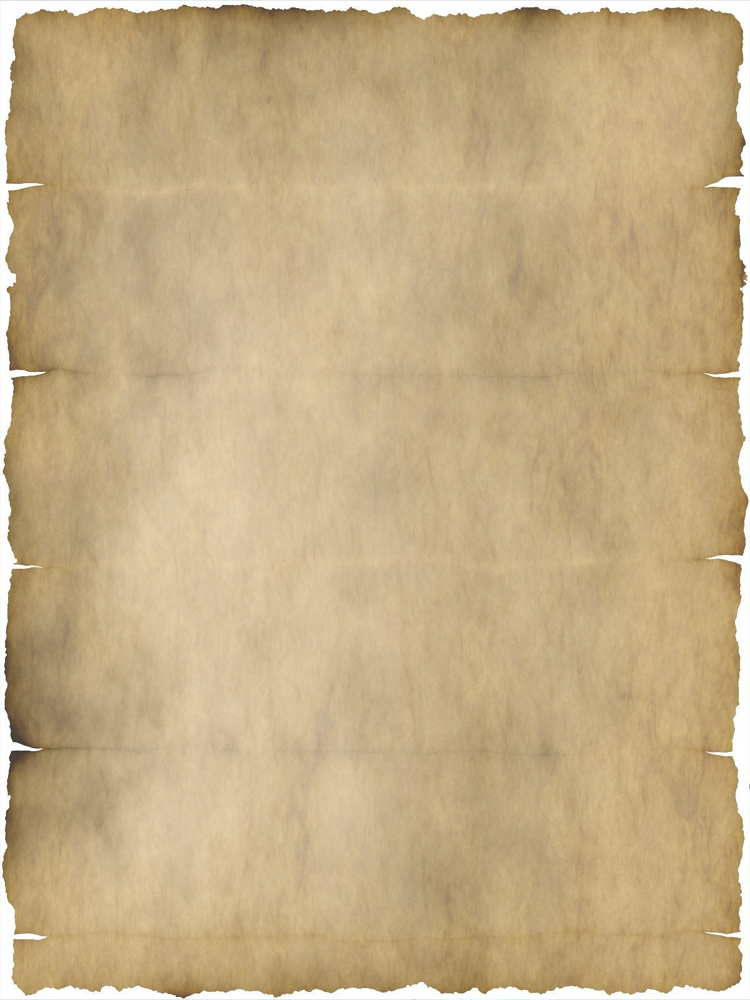

[← Vissza a főoldalra](/)

# A kézírás

**Szerző:** Orosz Sándor Ádám  
**Publikáció dátuma:** 2026. március 14.  
**Licenc:** CC BY-NC-SA 4.0  
**DOI:** [https://doi.org/10.5281/zenodo.19025003](https://doi.org/10.5281/zenodo.19025003)

---

## 📄 Letöltés

- **PDF (Zenodo):** [Letöltés vagy olvasás pdf-ben](https://doi.org/10.5281/zenodo.19025003)

## 📙 [Ugrás a kényelmes, online olvasóhoz](/olvaso/a_keziras.html)

- A szövegre kattintva jelenik meg a menürendszer

---

## Összefoglaló

A Kolossé levél 2,14-ben szereplő *cheirographon* („kézírás” vagy adóslevél) hagyományos, mózesi Törvénnyel való azonosítása komoly exegetikai nehézségekbe ütközik a pogánykeresztény címzettek kontextusában. Mivel a pogányok sosem álltak a Tóra joghatósága alatt, az nem lehetett az ő egyetemes, „ellenük szóló” vádiratuk. Jelen tanulmány azt a hipotézist vizsgálja, hogy a *cheirographon* nem egy partikuláris nemzeti törvénykönyv, hanem az emberiség szövetségi képviselet útján örökölt, ontológiai szintű adósságlevele.

A grammatikai-történeti exegézist és a papirológiai bizonyítékokat rendszerteológiai keretben ötvözve a kutatás rámutat: a kézírás jogalapját biztosító „rendelések” (*dogmata*) nem a sínai parancsolatokat, hanem az univerzális édeni halál-dekrétumot (1Móz 2,17) jelölik, amit a Második Templom korának irodalma és a korai patrisztikus hagyomány (Philón, Irenaeus, Athanasziosz) szóhasználata is megerősít.

  

## 🧭 Tartalomjegyzék

---

- [Absztrakt](#absztrakt)
- [1. Bevezetés](#1-bevezetés)
- [2. A *cheirographon* jogi természete](#2-a-cheirographon-jogi-természete)
- [3. Az ontológiai alap: Az ádámi adósság](#3-az-ontológiai-alap-az-ádámi-adósság)
- [4. Részletes exegézis: Kolossé 2,13–15](#4-részletes-exegézis-kolossé-21315)
- [5. A két szint megkülönböztetése](#5-a-két-szint-megkülönböztetése)
- [6. Az eltörlés terjedelme és érvényessége](#6-az-eltörlés-terjedelme-és-érvényessége)
- [7. Konklúzió](#7-konklúzió)
- [A. Melléklet: Filológiai bizonyítékok a *tois dogmasin* értelmezéséhez](#a-melléklet-filológiai-bizonyítékok-a-tois-dogmasin-értelmezéséhez)

---


{{ tartalom | markdownify }}
