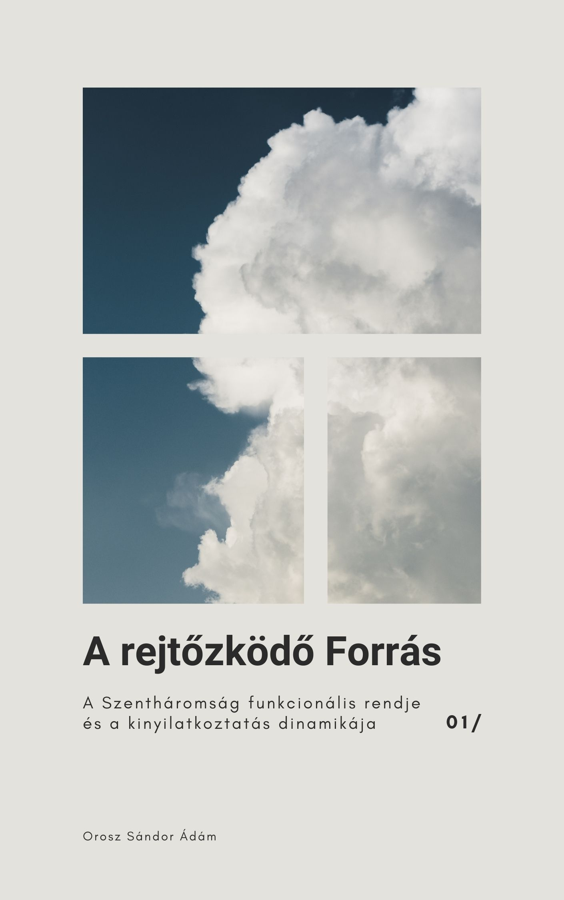

[← Vissza a főoldalra](/)

# A rejtőzködő Forrás

**Szerző:** Orosz Sándor Ádám  
**Publikáció dátuma:** 2025. szeptember 12.
**Licenc:** CC BY-NC-SA 4.0
**DOI:** [https://doi.org/10.5281/zenodo.16788070](https://doi.org/10.5281/zenodo.xxxxxxxx)

---

## 📄 Letöltés

- **PDF (Zenodo):** [Letöltés vagy olvasás pdf-ben](https://doi.org/10.5281/zenodo.xxxxxxxx)

## 📙 [Ugrás a kényelmes, online olvasóhoz](/olvaso/a_rejtozkodo_forras_olvaso.html)

- A szövegre kattintva jelenik meg a menürendszer

---

## Összefoglaló

Mi van, ha Isten nem egy mozdulatlan, filozófiai abszolútum, hanem egy dinamikus, cselekvő közösség?

„A rejtőzködő Forrás” című tanulmány a Biblia elbeszélését követve egy élő, relációs Szentháromság-képet vázol fel. Ebben a modellben az Atya a mindent elindító, transzcendens Forrás, aki rejtve marad, de minden cselekvés tőle indul ki. A Fiú és a Szentlélek azok a vele egylényegű, isteni személyek, akik a történelemben, a mi időnkben teszik láthatóvá és megtapasztalhatóvá ezt a rejtőzködő szeretetet. A végeredmény egy olyan Isten-kép, amely a távolságtartó dogmák helyett egy aktív, velünk kapcsolatban álló, a történelem drámájában velünk együtt cselekvő Istent tár fel.

  

## 🧭 Tartalomjegyzék

---

- [Absztrakt](#absztrakt)
- [1. Bevezetés: A vizsgálat keretei és célja](#1-bevezetés-a-vizsgálat-keretei-és-célja)
- [2. A menny nem üres](#2-a-menny-nem-üres)
- [3. Az Atya, a transzcendens Forrás](#3-az-atya-a-transzcendens-forrás)
- [4. Az idő és a Szentháromság üdvrendje](#4-az-idő-és-a-szentháromság-üdvrendje)
- [5. A filológiai pontosság](#5-a-filológiai-pontosság)
- [6. Klasszikus torzulások: A pálya kijelölése](#6-klasszikus-torzulások-a-pálya-kijelölése)
- [7. Modern viták: A modell pozicionálása](#7-modern-viták-a-modell-pozicionálása)
- [8. A modell ereje: Válaszok az egyház égető kérdéseire](#8-a-modell-ereje-válaszok-az-egyház-égető-kérdéseire)
- [A. Melléklet: A teológiai modellek összehasonlító elemzése](#a-melléklet-a-teológiai-modellek-összehasonlító-elemzése)

---


{{ tartalom | markdownify }}
