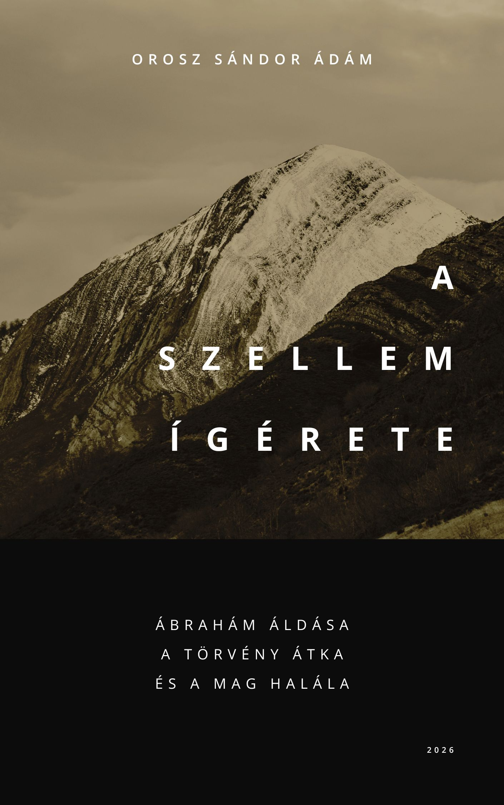

[← Vissza a főoldalra](/)

# A Szellem ígérete

**Szerző:** Orosz Sándor Ádám  
**Publikáció dátuma:** 2026. június 3.  
**Licenc:** CC BY-NC-SA 4.0  
**DOI:** [https://doi.org/10.5281/zenodo.20533162](https://doi.org/10.5281/zenodo.20533162)

---

## 📄 Letöltés

- **PDF (Zenodo):** [Letöltés vagy olvasás pdf-ben](https://doi.org/10.5281/zenodo.20533162)

## 📙 [Ugrás a kényelmes, online olvasóhoz](/olvaso/a_szellem_igerete.html)

- A szövegre kattintva jelenik meg a menürendszer

---

## Összefoglaló

A tanulmány a Gal 3,13–14 alapján azt vizsgálja, hogyan kapcsolódik össze Krisztus átokhalála, Ábrahám áldásának pogányokra jutása és a Szellem ígéretének hit általi elnyerése. Kiindulópontja, hogy Pál érvelésében a Törvény átka nem általános emberi állapotként, hanem a Törvény alatt állók sajátos szövetségi terheként jelenik meg. Ezt a tanulmány megkülönbözteti az ádámi kézírástól, amely az emberiség Ádámban fennálló közös jogi alaphelyzetét jelöli.

A vizsgálat fő tézise szerint Krisztus egyetlen kereszthalála két megkülönböztethető, de elválaszthatatlan jogi-szövetségi mozzanatban szolgálja ugyanazt a célt. Mint Ábrahám Magvának halála, lezárja azt a Törvény alatti jogviszonyt, amelybe Krisztus test szerint belépett, és feltámadásában a Törvény hatályán kívüli, krisztusi rendben hordozza tovább Ábrahám áldását. Mint átokhalál, a Törvény alatt állók mózesi átokszankcióját rendezi: Krisztus saját szövetségszegés nélkül, képviseleti-szövetségi alapon lép az átok helyére.

  

## 🧭 Tartalomjegyzék

---

- [Absztrakt](#absztrakt)
- [1. Bevezetés](#1-bevezetés)
- [2. Két jogi réteg: az ádámi kézírás és a mózesi átok](#2-két-jogi-réteg-az-ádámi-kézírás-és-a-mózesi-átok)
- [3. Krisztus mint Ábrahám Magva: halál és átokhalál](#3-krisztus-mint-ábrahám-magva-halál-és-átokhalál)
- [4. A Gal 3,13–14 jogi és grammatikai szerkezete](#4-a-gal-31314-jogi-és-grammatikai-szerkezete)
- [5. Összefoglalás és következtetések](#5-összefoglalás-és-következtetések)

---


{{ tartalom | markdownify }}
