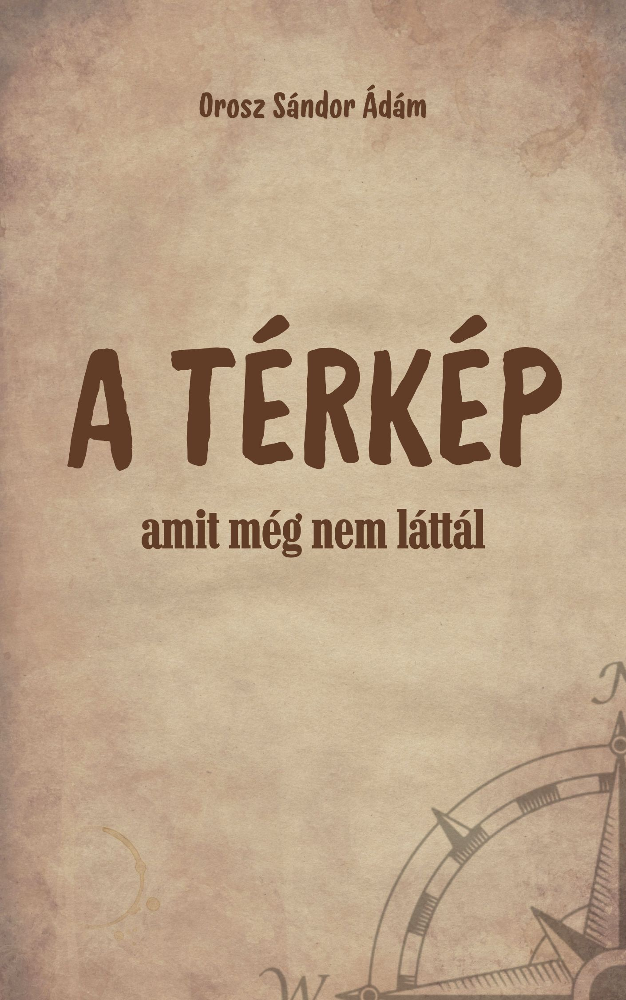

[← Vissza a főoldalra](/)

# A térkép, amit még nem láttál

**Szerző:** Orosz Sándor Ádám  
**Publikáció dátuma:** 2025. augusztus 10.  
**Licenc:** Minden jog fenntartva.
**DOI:** [https://doi.org/10.5281/zenodo.16788070](https://doi.org/10.5281/zenodo.16788070)

---

## 📄 Letöltés

- **PDF (Zenodo):** [Letöltés vagy olvasás pdf-ben](https://doi.org/10.5281/zenodo.xxxxxxxx)

## 📙 [Ugrás a kényelmes, online olvasóhoz](/olvaso/a_terkep_olvaso.html)

- A szövegre kattintva jelenik meg a menürendszer

---

## Összefoglaló

A Térkép, amit még nem láttál a Prédikátor könyvének időtlen bölcsességét ülteti át a modern kor kihívásaira. Öt tipikus életcsapdát – karrierhajszát, élmény-másnaposságot, információs túlterhelést, kiégett igazságérzetet és törékeny identitást – tár fel, és bibliai alapú, gyakorlati stratégiákat kínál a valódi öröm és stabil önazonosság megtalálásához.

  

## 🧭 Tartalomjegyzék

---

- [1. A játék, amit nem nyerhetsz meg](#1-a-játék-amit-nem-nyerhetsz-meg)
- [2. A rossz falhoz támasztott létra](#2-a-rossz-falhoz-támasztott-létra)
- [3. A FOMO és a bakancslista](#3-a-fomo-és-a-bakancslista)
- [4. Az információs zaj](#4-az-információs-zaj)
- [5. A kiégett igazságérzet](#5-a-kiégett-igazságérzet)
- [6. Ki vagyok én?](#6-ki-vagyok-én)
- [7. A játék titka](#7-a-játék-titka)
- [8. A játék, amit megnyerhetsz](#8-a-játék-amit-megnyerhetsz)

---


{{ tartalom | markdownify }}
