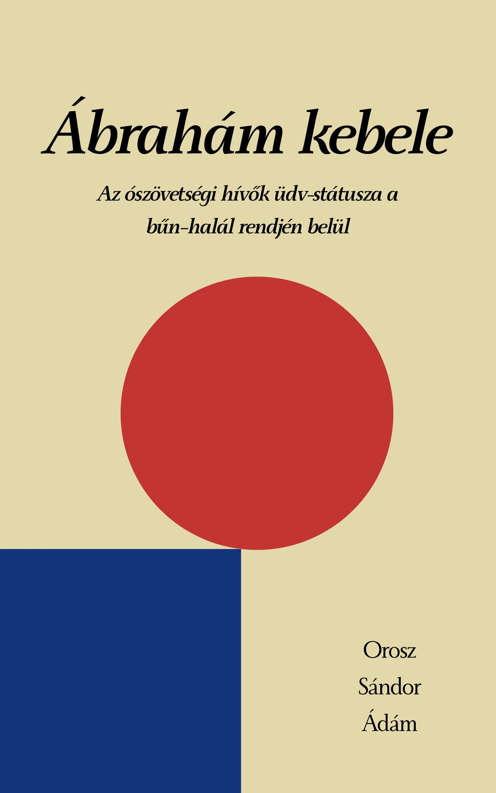

[← Vissza a főoldalra](/)

# Ábrahám kebele

**Szerző:** Orosz Sándor Ádám  
**Publikáció dátuma:** 2026. március 21.  
**Licenc:** CC BY-NC-SA 4.0  
**DOI:** [https://doi.org/10.5281/zenodo.19154727](https://doi.org/10.5281/zenodo.19154727)

---

## 📄 Letöltés

- **PDF (Zenodo):** [Letöltés vagy olvasás pdf-ben](https://doi.org/10.5281/zenodo.19154727)

## 📙 [Ugrás a kényelmes, online olvasóhoz](/olvaso/abraham_kebele.html)

- A szövegre kattintva jelenik meg a menürendszer

---

## Összefoglaló

Hogyan lehettek valóban igazak Isten előtt az ószövetségi hívők, ha Krisztus keresztje történetileg még nem valósult meg? Ez a tanulmány egy izgalmas és ritkán végiggondolt teológiai feszültséget bont ki: azt állítja, hogy az ószövetségi megigazulás valós, érvényes isteni verdikt volt, mégis egy köztes üdv-státuszt implikált, mert a végső beteljesedésre még várni kellett. Az írás új fényben értelmezi az „Ábrahám kebelét”, és amellett érvel, hogy Krisztus műve nemcsak a jövőt nyitotta meg, hanem végleg lezárta a régi szövetség igazainak várakozását is.

  

## Tartalomjegyzék

---

- [Absztrakt](#absztrakt)
- [1. Bevezetés](#1-bevezetés)
- [2. Az ószövetségi hívők megigazulása](#2-az-ószövetségi-hívők-megigazulása)
- [3. A bűn két szintje: ontológiai státusz és funkcionális tettek](#3-a-bűn-két-szintje-ontológiai-státusz-és-funkcionális-tettek)
- [4. Az engesztelés mintájának isteni eredete](#4-az-engesztelés-mintájának-isteni-eredete)
- [5. Ábrahám kebele: a köztes üdv-státusz (Lk 16,19–31)](#5-ábrahám-kebele-a-köztes-üdv-státusz-lk-161931)
- [6. Ábrahám kebele és Krisztus keresztje](#6-ábrahám-kebele-és-krisztus-keresztje)
- [7. Záró tézisek](#7-záró-tézisek)

---


{{ tartalom | markdownify }}
