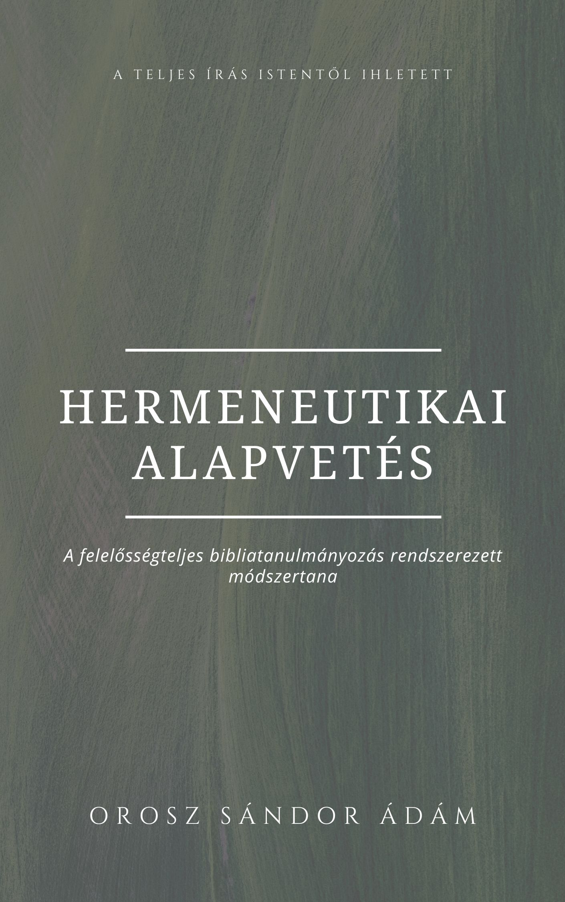

[← Vissza a főoldalra](/)

# Hermeneutikai alapvetés 
## A felelősségteljes bibliatanulmányozás rendszerezett módszertana

**Szerző:** Orosz Sándor Ádám  
**Publikáció dátuma:** 2025. július 06.  
**Licenc:** Minden jog fenntartva. 
**DOI:** [https://doi.org/10.5281/zenodo.15818855](https://doi.org/10.5281/zenodo.15818855)
---

## 📄 Letöltés

- **PDF (Zenodo):** [Letöltés vagy olvasás pdf-ben](https://doi.org/10.5281/zenodo.15818855)

## 📙 [Ugrás a kényelmes, online olvasóhoz](/olvaso/hermeneutika_olvaso.html)
 
 - A szövegre kattintva jelenik meg a menürendszer

---

## Összefoglaló

A Hermeneutikai alapvetés egy rendszerezett módszertant kínál a felelős bibliatanulmányozáshoz, amely hidat épít a hívő elköteleződés és a tudományos igényesség között. A tanulmány öt teológiai alapelvre építve vázol fel egy nyolclépéses, gyakorlati protokollt a szöveghű és ellenőrizhető exegézishez. A cél egy olyan fegyelmezett keretrendszer, amely a mai információs korban is megbízható alapot nyújt az Írás értelmezéséhez.

  

## 🧭 Tartalomjegyzék

- [Bevezetés](#bevezetés)
- [Fundamentum](#fundamentum)
- [Értelmezési és módszertani irányelvek](#értelmezési-és-módszertani-irányelvek)
- [Zárszó](#zárszó)

---


{{ tartalom | markdownify }}
