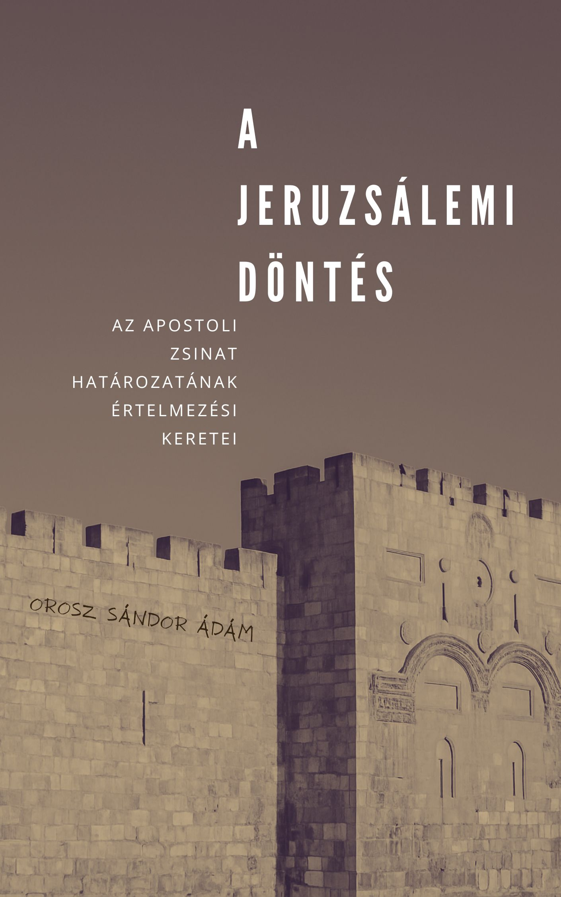

[← Vissza a főoldalra](/)

# A jeruzsálemi döntés  
## Az apostoli zsinat határozatának értelmezési keretei

**Szerző:** Orosz Sándor Ádám  
**Publikáció dátuma:** 2025. május 30.  
**Licenc:** Creative Commons CC BY 4.0  
**DOI:** [https://doi.org/10.5281/zenodo.15546416](https://doi.org/10.5281/zenodo.15546416)

---

## 📄 Letöltés - **PDF (Zenodo):** 

- [Letöltés vagy olvasás pdf-ben](https://doi.org/10.5281/zenodo.15546416)

## 📙 [Ugrás a kényelmes, online olvasóhoz](/olvaso/jeruzsalemi_dontes_olvaso.html)
 
 - A szövegre kattintva jelenik meg a menürendszer

---

## Összefoglaló

A jeruzsálemi zsinat döntése egyszerre oldott fel teológiai feszültséget és teremtett új közösségi rendet: elhárította a Mózesi Törvény teljes kötelezettségének terhét a pogány hívőkről, miközben négy tilalommal mégis határt vont. De vajon milyen hagyományrétegek formálták ezt a meglepően tömör, mégis súlyos tartalmú rendelkezést? Univerzális erkölcsi elvek, konkrét tórai előírások, vagy egy Szentlélek vezette szintézis? A tanulmány e kérdések mentén vizsgálja a döntés mélyebb rétegeit, és párhuzamokat keres a mai keresztény közösségek dilemmáival.

  

> *„A Szentléleknek és nékünk tetszett…” (ApCsel 15:28)*

---

## 🧭 Tartalomjegyzék

- [1. Bevezetés](#1-bevezetes)
- [2. A hét noahita törvény](#2-a-hét-noahita-törvény)
- [3. A „jövevénytörvények”](#3-a-jövevénytörvények)
- [4. A jeruzsálemi zsinat](#4-a-jeruzsálemi-zsinat)
- [5. Értelmezési modellek](#5-értelmezési-modellek)
- [6. Összegzés](#6-összegzés)
- [7. A jeruzsálemi döntés hatása napjainkban](#7-a-jeruzsálemi-döntés-hatása-napjainkban)
- [8. Irodalomjegyzék](#8-irodalomjegyzék)

---


{{ tartalom | markdownify }}
