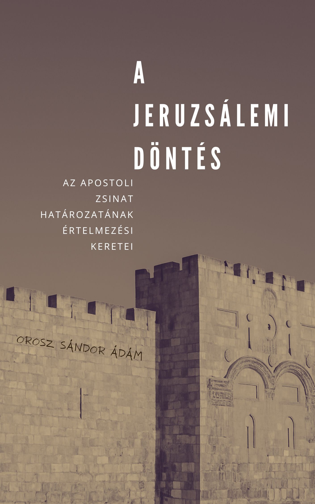

[← Vissza a főoldalra](/)

# A jeruzsálemi döntés  
## Az apostoli zsinat határozatának értelmezési keretei

**Szerző:** Orosz Sándor Ádám  
**Publikáció dátuma:** 2025. május 30.  
**Licenc:** Creative Commons CC BY 4.0  
**DOI:** [https://doi.org/10.5281/zenodo.15546416](https://doi.org/10.5281/zenodo.15546416)
---

## 📄 Letöltés

- **PDF (Zenodo):** [Letöltés](https://doi.org/10.5281/zenodo.15546416)

## Összefoglaló

A jeruzsálemi zsinat döntése egyszerre oldott fel teológiai feszültséget és teremtett új közösségi rendet: elhárította a Mózesi Törvény teljes kötelezettségének terhét a pogány hívőkről, miközben négy tilalommal mégis határt vont. De vajon milyen hagyományrétegek formálták ezt a meglepően tömör, mégis súlyos tartalmú rendelkezést? Univerzális erkölcsi elvek, konkrét tórai előírások, vagy egy Szentlélek vezette szintézis? A tanulmány e kérdések mentén vizsgálja a döntés mélyebb rétegeit, és párhuzamokat keres a mai keresztény közösségek dilemmáival.

  

> *„A Szentléleknek és nékünk tetszett…” (ApCsel 15:28)*

---

## 🧭 Tartalomjegyzék

- [1. Bevezetés](#1-bevezetes)
- [2. A hét noahita törvény](#2-a-hét-noahita-törvény)
- [3. A „jövevénytörvények”](#3-a-jövevénytörvények)
- [4. A jeruzsálemi zsinat](#4-a-jeruzsálemi-zsinat)
- [5. Értelmezési modellek](#5-értelmezési-modellek)
- [6. Összegzés](#6-összegzés)
- [7. A jeruzsálemi döntés hatása napjainkban](#7-a-jeruzsálemi-döntés-hatása-napjainkban)
- [8. Irodalomjegyzék](#8-irodalomjegyzék)

---

# 1. Bevezetés

Az Apostolok cselekedetei 15. fejezete az ősegyház egyik meghatározó teológiai és gyakorlati kihívását tárja elénk. A fő kérdés az volt: hogyan integrálhatók a pogány nemzetek Isten népének közösségébe anélkül, hogy rájuk kényszerítenék a Mózesi Törvény teljes megtartását, különös tekintettel a körülmetélkedésre? A jeruzsálemi zsinat döntése, miszerint a pogányokat nem terheli a Törvény teljes igája, de tartózkodniuk kell „a bálványoknak áldozott dolgoktól, a paráznaságtól, a fúlva holt állattól és a vértől” (ApCsel 15:29), meghatározó lépés volt az egyház egyetemessé válásának útján. De mi volt ennek a specifikus, négy pontból álló listának a pontos teológiai alapja és gyakorlati célja?

A döntés hátterének több értelmezési kerete is van. E tanulmány célja nem egyetlen, kizárólagos magyarázat mellett érvelni, hanem bemutatni azokat a főbb történeti és teológiai alapokat, amelyekre az apostoli rendelkezések épülhettek, feltárva a kérdés összetettségét és a lehetséges interpretációk sokféleségét.
Vizsgálatunk során feltérképezzük azokat a potenciális gyökereket, amelyek hozzájárulhattak a zsinati határozat kialakulásához. Figyelmet fordítunk két tartalmi forrásra, amelyek a korabeli zsidó felfogásban és a Szentírásban is jelen voltak:

- **Az univerzális erkölcsi elvek**: A zsidó hagyomány ismerte azt a koncepciót, hogy léteznek olyan alapvető isteni elvárások, amelyek nemcsak Izraelre, hanem az egész emberiségre érvényesek. Ezeket az elveket később a hét noahita törvényként kodifikálták.[^1] Kérdés, hogy a zsinati döntés pontjai mennyiben tükrözik ezt az univerzális erkölcsi minimumot, amely a hagyomány szerint minden Istent követő embertől elvárható.

- **A specifikus „jövevénytörvények”**: A Mózesi Törvény, különösen a Leviticus 17–18. fejezeteiben, konkrét előírásokat tartalmazott az Izrael közösségében élő, de nem zsidó származású személyekre („jövevényekre”) vonatkozóan. Ezek a törvények olyan kritikus területeket szabályoztak (kultusz, étkezési szokások, szexuális etika), amelyek a zsidó és nem zsidó együttélés szempontjából alapvetőek voltak. Vizsgáljuk, hogy a zsinat rendelkezései mennyiben támaszkodhattak erre a konkrét, Szentíráson alapuló modellre a közösségi egység biztosítása érdekében.

Ezen túlmenően felvetjük azt a lehetőséget is, hogy a jeruzsálemi döntés nem kizárólag egyetlen alapra épült. Feltételezhető, hogy a határozat az univerzális erkölcsi elvek és a konkrét bibliai előírások tudatos vagy ösztönös szintéziseként született meg. Ez a megközelítés egyszerre szolgálta a pogánykeresztény identitás kialakítását, illetve a zsidó és pogány származású hívek békés együttélésének biztosítását.

A tanulmány tehát arra törekszik, hogy bemutassa ezeket a lehetséges értelmezési kereteket, részletezve azok történeti és teológiai hátterét, valamint kapcsolódásukat az ApCsel 15-ben leírt döntéshez. Célunk, hogy az olvasó teljesebb képet kapjon a jeruzsálemi zsinat határozatának összetettségéről, és maga mérlegelhesse az egyes modellek magyarázó erejét és relevanciáját.

[^1]: A noahita törvények történeti fejlődésének és kodifikációjának részletes elemzéséért lásd David Novak, *The Image of the Non-Jew in Judaism: An Historical and Constructive Study of the Noahide Laws* (New York: Edwin Mellen Press, 1983), 11–35. o.

# 2. A hét noahita törvény

A zsidó teológiai gondolkodásban központi helyet foglal el az a meggyőződés, hogy Isten mint az egész világ Teremtője és Ura, nemcsak Izrael népével áll szövetségben, hanem az egész emberiséggel is. Ennek az egyetemes kapcsolatnak az erkölcsi alapját a zsidó hagyomány a hét noahita törvényben (héberül: _Sheva Mitzvot B'nei Noach_) fogalmazza meg. Ezeket alapvető isteni elvárásoknak tekintették, amelyek Noén keresztül minden emberre érvényesek.

A jeruzsálemi zsinat döntésének hátterét vizsgálva ennek a koncepciónak azért lehet jelentősége, mert egy univerzális erkölcsi minimumot képvisel. Ez _potenciálisan_ alapul szolgálhatott az apostolok számára, amikor a pogányokból lett hívők felé alapvető elvárásokat fogalmaztak meg, függetlenül a Mózesi Törvény specifikus előírásaitól. A vizsgálat tárgya, hogy a noahita törvények lehetnek-e az a közös erkölcsi alap, amely a zsinati rendelkezéseket indokolja.

## 2.1 A koncepció történeti kialakulása és jelentősége

A „hét noahita törvény” mint specifikus, rögzített lista nem szerepel expliciten ebben a formában a Bibliában. A koncepció fokozatosan alakult ki a rabbinikus judaizmuson belül a Tóra (különösen a Teremtés könyve) mélyreható értelmezése révén. A rabbik visszavezették ezeknek az alapelveknek a gyökereit Isten Ádámnak és Noénak adott parancsaira, úgy értelmezve, hogy ezek az egész emberiségre vonatkozó, örök érvényű isteni elvárások. Bár a lista pontos és részletes kidolgozása elsősorban a Talmud korszakában történt meg, különösen a Szanhedrin traktátusban (56a–60a[^2]), az alapelvek ennél korábbra nyúlnak vissza. Ilyen alapelvek például Isten egyedüliségének elismerése, az emberi élet szentsége, a tulajdon tisztelete, a család rendje és az igazságosságra való törekvés. Ezek már az I. századi zsidó gondolkodásban is mélyen gyökerezhettek, és az Isten által az egész világ számára rendelt erkölcsi minimumként értelmezték őket.

Ezeknek az elveknek az ismertsége az apostolok számára egy lehetséges teológiai keretet biztosíthatott annak megértéséhez, hogy milyen alapvető erkölcsi normák várhatók el a pogányoktól, amikor csatlakoznak Isten népéhez Krisztusban. Mindez lehetővé tette, hogy ne kelljen rájuk róni a Sínai-szövetség specifikus törvényeit.

## 2.2 A hét törvény és hagyományos rabbinikus levezetésük

A rabbinikus hagyomány hét alapvető parancsolatot azonosított a pogányok számára:

1. **Bálványimádás tilalma** (_Avoda Zara_ – idegen szolgálat): Az egyetlen igaz Isten elismerése és minden más istenség vagy teremtett dolog imádatának elutasítása. Ez Istennek mint Teremtőnek az egyedüliségéből fakad (vö. Gen 2:16 implicit értelmezése, mint Isten tekintélyének elfogadása). Ez az alapja minden helyes isten-ember kapcsolatnak.

2. **Istenkáromlás tilalma** (_Birkat Ha-Sem_ – a Név megáldása, ez eufemisztikus kifejezés): Isten nevének és szentségének tiszteletben tartása, a Teremtő iránti tisztelet kifejezése. Szintén a Teremtő és teremtmény viszonyából fakad (vö. Gen 2:16 tiszteletre vonatkozó aspektusa). Ez az Isten iránti tisztelet alapja.

3. **Emberölés tilalma** (_Sefichut Damim_ – vér ontása): Az emberi élet szentségének elismerése, amely abból fakad, hogy az ember Isten képmására teremtetett (Gen 9:6). Ez az emberi élet értékének alapja.

4. **Lopás tilalma** (_Gezel_ – lopás): A tulajdon tiszteletben tartása, a másik javainak jogtalan elvételének tilalma. A teremtés rendjének és a társadalmi igazságosságnak az alapja (gyakran a Gen 2:16–17 tiltott fájára hivatkozva, mint a tulajdonjog elvének lefektetése).

5. **Tiltott szexuális kapcsolatok tilalma** (_Giluj Arajot_ – meztelenség felfedése): Az alapvető családi és házassági rend tiszteletben tartása, bizonyos szexuális kapcsolatok (pl. vérfertőzés, házasságtörés, bestialitás a rabbinikus értelmezés szerint) elutasítása. A teremtési rendre épül (Gen 2:24). Ez a család és a társadalom erkölcs alapja.

6. **Élő állatból származó tag evésének tilalma / Vér tilalma** (_Ever min ha-Chaj_ – élőből való testrész): Az élet tisztelete és a kegyetlenség elutasítása az állatvilággal szemben (Gen 9:4). A vér mint az élet szimbóluma kiterjeszti az élet tiszteletét a teremtett világra.

7. **Igazságszolgáltatás (bíróságok) felállításának kötelezettsége** (_Dinim_ – ítéletek): A társadalmi rend fenntartása, a törvények betartatása és az igazság érvényesítése érdekében működő jogrendszer létrehozásának és fenntartásának kötelezettsége (implicit alapja pl. Gen 9:5–6 számonkérése, Gen 18:19 Ábrahám küldetése). Ez a rendezett társadalom és a jogállamiság alapja.

Ezek a törvények együttesen egy olyan átfogó erkölcsi keretrendszert alkotnak, amely a zsidó gondolkodás szerint Isten minden emberre kiterjedő akaratát tükrözi. Kérdés, hogy ez az univerzális erkölcsi alap önmagában elégséges magyarázatot adhat-e az apostoli döntés tartalmára.

## 2.3 A noahita törvények ismertsége az apostoli korban

Ahhoz, hogy a noahita törvények koncepciója releváns háttér lehessen a jeruzsálemi zsinat számára, vizsgálni kell, mennyire voltak ismertek ezek az elvek az I. században. Több jel is utal arra, hogy az univerzális erkölcsi elvárások gondolata és annak bizonyos elemei valóban jelen voltak az apostoli kor zsidó kulturális közegében:

- Jubileumok könyve[^3] (Kr. e. II–I. sz.) Noé unokáinak ad „parancsolatokat és rendeléseket”, közöttük a vérfogyasztás, a paráznaság és a bálványos tisztátalanság tiltását – pontosan azokat a területeket érintve, amelyek az apostoli dekrétumban is megjelennek. A szöveg qumráni leletei palesztinai ismertségét mutatják.
- A hellenisztikus zsidó filozófus, Philo Alexandrinus a De specialibus legibus IV, 143–150 passzusban[^4] arról értekezik, hogy a nem írott törvények minden ember lelkébe „a szülőföldi szokásokként” vannak bevésve, említve a bálványimádás kerülését, a vérontás elutasítását és a tiszta erkölcsöt – fogalmi készlete hasonló az ApCsel 15 által érintett témákhoz.
- A Tosefta Avoda Zara 8:4-es[^5] baraitája, amely a jeruzsálemi farizeus iskolák hagyományát őrzi és amelynek anyaga részben az I. századra datálható, expliciten felsorolja a klasszikus hét noahita törvényt. Pál, mint Gamáliel tanítványa, ismerhette ezt a hagyományt.
- A palesztinai midrás-hagyomány, például a Genesis Rabbah 34:8[^6], szintén megerősíti a héttagú lista ismeretét ebben a korban.
- Modern kutatók, mint Markus Bockmuehl[^7], rámutattak arra, hogy az ApCsel 15 négyes tilalma felfogható a noahita kánon egyfajta „rövidített formájaként”, amely ismerős lehetett a zsinagógákat látogató „istenfélő” pogányok számára.

Mindezek alapján feltételezhető, hogy az univerzális isteni elvárások gondolata, és annak elemei ismertek voltak az apostoli korban. Ezáltal a noahita törvények koncepciója _egy valós és releváns keretet kínál_, amelyből az apostolok meríthettek. A későbbi elemzés során visszatérünk arra, hogy ez a keret önmagában, vagy más tényezőkkel együtt hogyan viszonyul a zsinat konkrét döntéséhez.

[^2]: *b. Sanhedrin 56a–60a*. Fordította Jacob Shachter és H. Freedman. In: *The Babylonian Talmud*, szerk. I. Epstein (London: Soncino Press, 1935).

[^3]: *Book of Jubilees 6:7–13; 7:20–28*. In: James C. VanderKam, *Jubilees: A Commentary*, Hermeneia—A Critical and Historical Commentary on the Bible (Minneapolis: Fortress Press, 2018), 298, 331. o.

[^4]: Philo, *De specialibus legibus* IV 143–150. Fordította C. D. Yonge. In: *The Works of Philo* (Peabody, MA: Hendrickson Publishers, 1993), 622. o.

[^5]: *Tosefta Avodah Zarah 8:4*. In: Jacob Neusner (ford.), *The Tosefta: Translated from the Hebrew with a New Introduction*, vol. 2 (Peabody, MA: Hendrickson Publishers, 2002), 1553. o.

[^6]: *Genesis Rabbah 34:8*. In: Jacob Neusner (ford.), *Genesis Rabbah: The Judaic Commentary to the Book of Genesis, A New American Translation*, vol. 2 (Atlanta: Scholars Press, 1985), 5. o.

[^7]: Markus Bockmuehl, „The Noachide Commandments and New Testament Ethics”, *Revue Biblique* 102 (1995), 72–101. o.

# 3. A „jövevénytörvények”

Míg a noahita törvények koncepciója egy univerzális erkölcsi alapot kínálhatott az apostoli döntéshez, a Szentírás egy másik, specifikusabb rétege is releváns lehet a jeruzsálemi zsinat határozatainak megértésében. Ez a Mózesi Törvényen belül található rendelkezések csoportja, amelyek kifejezetten az Izrael közösségében tartósan élő, de nem zsidó származású személyekre, a „jövevényekre” (héberül: _ger_, többes szám: _gerim_) vonatkoztak. Különösen a Leviticus könyvének 17. és 18. fejezetei tartalmaznak olyan előírásokat, amelyek figyelemre méltó párhuzamot mutatnak az apostoli dekrétum pontjaival.

Kérdés: Vajon ez a Tórán belüli, konkrét helyzetekre adott válasz szolgált-e közvetlen mintaként az apostolok számára, amikor a pogánykeresztények befogadásának gyakorlati kérdéseivel szembesültek? Tekinthető-e a leviticusi modell annak a kulcsnak, amely elsősorban a közösségi egység megőrzését és a gyakorlati együttélés szabályozását célozta?

## 3.1 A „jövevény” *(ger)* fogalma és helyzete a Tórában

A _ger_ fogalma olyan idegen származású személyt jelölt, aki nem csupán átutazó volt, hanem tartósan letelepedett Izrael földjén. Noha általában nem számított a szövetségi közösség teljes jogú tagjának (hiszen nem volt körülmetélve), helyzete mégsem volt azonos egy teljesen kívülállóéval.[^8] A Tóra számos helyen nyomatékosan előírja a jövevényekkel szembeni igazságos és szeretetteljes bánásmódot, emlékeztetve Izraelt saját egyiptomi múltjára (pl. Ex 22:20; Lev 19:33-34; Deut 10:19).

Ugyanakkor a Tóra bizonyos alapvető törvények betartását a jövevényektől is elvárta. Ezek jellemzően olyan rendelkezések voltak, amelyek a közösség szentségének megőrzésével, a környező pogány kultuszoktól való szükséges elhatárolódással, valamint a békés társadalmi együttéléssel függtek össze. E törvények célja kettős volt: egyrészt megakadályozni az idegen vallási gyakorlatok negatív hatását Izrael Istennel való kapcsolatára és a Szentföldre, másrészt lehetővé tenni a zsidók és nem zsidók közötti mindennapi interakciót bizonyos alapvető normák közös elfogadása révén.

## 3.2 Leviticus 17–18

Leviticus könyvének 17. és 18. fejezetei központi szerepet töltenek be a Törvény szentséggel kapcsolatos tanításában. Olyan kritikus területeket szabályoznak, amelyek az ókori Közel-Kelet vallási és társadalmi kontextusában kiemelt jelentőséggel bírtak, és amelyek gyakran a pogány népek kultikus gyakorlataihoz kapcsolódtak. Ezek a fejezetek több ponton kifejezetten kiterjesztik az előírásokat a jövevényekre is:

- **Áldozatbemutatás és bálványimádás tilalma** (Lev 17:1–9): A fejezet szigorúan előírja, hogy minden vágóállatból származó áldozatot a szent sátor (később a Templom) bejáratához kell vinni, megtiltva a „mezőn” vagy „ördögöknek” (_szeirim_, démoni lényeknek) történő áldozatbemutatást. A szöveg expliciten kimondja: ez a rendelkezés egyaránt vonatkozik „_Izrael házára, vagy a köztük tartózkodó jövevényre_” (Lev 17:8). Ez az előírás közvetlenül kapcsolódik a bálványimádás és az ahhoz társuló kultikus étkezések elutasításához, ami párhuzamba állítható az ApCsel 15 bálványáldozati hústól való tartózkodásával.
- **Vérfogyasztás tilalma** (Lev 17:10–14): Ez a szakasz tartalmazza talán a leggyakrabban ismételt és legsúlyosabb tilalmat a vér bármilyen formában történő fogyasztására vonatkozóan. Isten a vért az élet princípiumaként jelöli ki, amelynek engesztelő szerepe van az oltáron (Lev 17:11). Ezért a vér elfogyasztását mind az izraelitáknak, mind a jövevényeknek szigorúan megtiltja: „_És ha valaki Izrael házából, vagy a köztük tartózkodó jövevények közül valamiféle vért megeszik: kiontom haragomat az ellen, aki a vért megette, és kiirtom azt az ő népei közül._” (Lev 17:10). Ez a parancs egyértelmű párhuzamot mutat az ApCsel 15 vértől való tartózkodásával. A tilalom logikus gyakorlati következménye a nem megfelelően (fojtás által) megölt, tehát ki nem véreztetett állatok húsának kerülése is (vö. Lev 17:15 a döglött vagy széttépett állat evésének tisztátalanságáról), ami kapcsolatba hozható az ApCsel 15 fúlvaholt állattól való tartózkodásával.[^9]
- **Tiltott szexuális kapcsolatok** (Lev 18): Ez a fejezet részletesen felsorolja azokat a szexuális viselkedésformákat (vérfertőzés különböző esetei, házasságtörés, homoszexuális aktusok, bestialitás), amelyeket Isten utálatosnak minősít, és amelyeket az Izraelt körülvevő népek (Egyiptom és Kánaán) gyakorlataként azonosít. A fejezet végén Isten komoly figyelmeztetést fogalmaz meg: ezen utálatosságok miatt űzi ki a kánaáni népeket, és a föld maga is „_kiokádja_” lakosait, ha azok ilyen módon beszennyezik azt. A fejezet explicit módon kiterjeszti e tilalmakat a jövevényekre is: „_Tartsátok meg azért ti az én rendeléseimet és végzéseimet, és ez utálatosságok közül semmit meg ne cselekedjetek, se a bennszülött, se a közöttetek tartózkodó jövevény_” (Lev 18:26). Ez párhuzamot mutat az ApCsel 15 paráznaságtól való tartózkodás követelményével.

## 3.3 A leviticusi minta jelentősége a jeruzsálemi döntésben

A Leviticus 17–18-ban található „jövevénytörvények” relevanciája a jeruzsálemi zsinat döntésének megértésében több szempontból is megmutatkozhat:

- **Konkrét bibliai precedens:** Az apostolok egy olyan helyzettel szembesültek (nem zsidók csatlakozása Isten népéhez és az ebből fakadó együttélési kérdések), amely jelentős analógiát mutatott a Törvény által már szabályozott helyzettel. Leviticus 17–18 egy konkrét, Szentíráson alapuló modellt kínált arra, hogy milyen alapvető elvárásokat lehet és kell támasztani a közösséghez csatlakozó, de nem zsidó származású tagokkal szemben, anélkül, hogy a Törvény teljes terhét rájuk rónák.
- **Tartalmi egyezés:** Ahogy láttuk, az apostoli dekrétumban megfogalmazott négy rendelkezés feltűnően pontosan megfelel a Leviticus 17–18 fő tilalmainak, amelyeket a Törvény a jövevényekre is kiterjesztett. Ez a pontosság felveti annak erős lehetőségét, hogy az apostolok tudatosan támaszkodtak erre a bibliai mintára.
- **Gyakorlati fókusz a közösségi kohézióra:** Ezek a leviticusi törvények pontosan azokat a gyakorlati területeket szabályozták, amelyek a legnagyobb feszültséget kelthették a zsidók és nem zsidók közötti mindennapi érintkezésben, és amelyek a leginkább megkülönböztették Izrael népét a környező pogány kultúráktól. Ezen alapvető minimumok betartása tette lehetővé a társadalmi és vallási interakciót (például az asztalközösséget), hozzájárulva a közösség egységének és Isten előtti szentségének megőrzéséhez. Elképzelhető, hogy az apostolok, amikor ezeket a pontokat emelték ki, elsősorban ezt a gyakorlati, közösségépítő célt tartották szem előtt.

Összefoglalva, a Leviticus 17–18-ban található, jövevényekre is vonatkozó törvények egy erős, Szentíráson alapuló magyarázó keretet kínálnak a jeruzsálemi zsinat döntésének megértéséhez. Ez a modell különösen a döntés konkrét tartalmát és gyakorlati, közösségi kohéziót célzó funkcióját világíthatja meg. A következő lépés annak vizsgálata, hogy ez a modell, a noahita keret, vagy esetleg a kettő kombinációja adja-e a legteljesebb képet a történtekről.

[^8]: A *ger* komplex jogi és társadalmi státuszáról az ókori Izraelben lásd Jacob Milgrom, *Leviticus 17–22: A New Translation with Introduction and Commentary*, Anchor Bible 3A (New York: Doubleday, 2000), 1459–1464. o.

[^9]: Vö. Milgrom részletes kommentárjával, amely a jövevényekre (*gerim*) vonatkozó törvények kontextusát és jelentését elemzi e fejezetekben. Milgrom, *Leviticus 17–22*, 1459–1464. o.

# 4. A jeruzsálemi zsinat

Az Apostolok Cselekedetei 15. fejezete a korai egyház egyik legjelentősebb fordulópontját, az ún. jeruzsálemi apostoli zsinatot írja le. Az eseményt egy akut krízis hívta életre, amely Pál és Barnabás első missziós útja nyomán robbant ki: a pogányok tömeges megtérése komoly teológiai és gyakorlati feszültséget okozott a túlnyomórészt zsidókból álló ősegyházban. A központi kérdés az volt, hogy a pogányokból lett keresztényeknek alá kell-e vetniük magukat a körülmetélkedésnek és a teljes Mózesi Törvény megtartásának ahhoz, hogy üdvözüljenek és teljes jogú tagjai legyenek Isten népének (ApCsel 15:1, 5).

A vita – amelyet kezdetben Antiókhiában folytatott Pál és Barnabás (ApCsel 15:2) – Jeruzsálembe, az egyház akkori központjába helyeződött át. Itt az apostolok és a vének összegyűltek, hogy megvitassák ezt a kérdést, amely az egyház jövőjét és küldetésének irányát alapvetően meghatározta.
A tanácskozás során több felszólalás hangzott el:

- **Péter bizonyságtétele** (ApCsel 15:7–11): Péter emlékeztetett arra, hogy Isten őt választotta ki arra, hogy a pogányok (Kornéliusz és háza népe) először hallják meg az evangéliumot. Hangsúlyozta, hogy Isten nem tett különbséget zsidó és pogány között, hanem a Szentlélek kitöltésével tett bizonyságot mellettük, és „_hit által tisztította meg szívüket_”. Arra figyelmeztetett, hogy ne kísértsék Istent azzal, hogy olyan „_igát_” (a Törvényt) akarnak a tanítványok nyakába helyezni, amelyet sem atyáik, sem ők nem tudtak elhordozni. Kijelentette, hogy mind zsidók, mind pogányok „_az Úr Jézus Krisztus kegyelme által_” üdvözülnek.
- **Pál és Barnabás beszámolója** (ApCsel 15:12): A misszionáriusok elbeszélték azokat a „_jeleket és csodákat_”, amelyeket Isten általuk cselekedett a pogányok között, ezzel is alátámasztva Isten munkájának valóságát és elfogadását a nemzetek körében.
- **Jakab összefoglalása és javaslata** (ApCsel 15:13–21): Jakab, a jeruzsálemi gyülekezet vezetője, összefoglalta a helyzetet. Egyetértett Péterrel, rámutatva, hogy a pogányok megtérése összhangban van a prófétai ígéretekkel (idézve Ámosz 9:11–12 LXX fordítását), miszerint Isten helyreállítja Dávid sátorát, hogy „_megkeresse az emberek maradéka az Urat, és a pogányok mindnyájan, akikről az én nevem neveztetett_”. Jakab ebből azt a következtetést vonta le, hogy nem szabad „_megnehezíteni_” azoknak a pogányoknak a dolgát, akik Istenhez térnek.[^10] Ugyanakkor javaslatot tett egy konkrét iránymutatás megfogalmazására: „_Hanem írjuk meg nekik, hogy tartózkodjanak a bálványok fertelmességeitől [vagy: tisztátalanságaitól], a paráznaságtól, a fúlva holt állattól és a vértől._” Javaslatát azzal indokolta, hogy „_Mert Mózesnek régi nemzedékek óta városonként megvannak a hirdetői, mivelhogy a zsinagógákban minden szombaton olvassák._” (ApCsel 15:21) – utalva ezzel valószínűleg arra, hogy ezek a pontok segíthetnek a zsidó és pogány hívek közötti békés együttélésben, tekintettel a Törvényt ismerő és tisztelő zsidókeresztények érzékenységére.[^11]

A zsinat, a Szentlélekkel való egyetértését hangsúlyozva („_tetszett a Szentléleknek és nekünk_” – ApCsel 15:28), elfogadta Jakab javaslatát. A döntést levél formájában közölték az antiókhiai, szíriai és ciliciai gyülekezetekkel (ApCsel 15:23–29). A levél megerősítette, hogy a pogány híveket nem terhelik a Mózesi Törvény előírásai (beleértve a körülmetélkedést), kivéve a négy említett „_szükséges_” dolgot:

1. Tartózkodás a bálványoknak áldozott dolgoktól (_eidólothüta_ – bálványnak áldozott étel)
2. Tartózkodás a vértől (_haima_ – vér)
3. Tartózkodás a fúlva holt állattól (_pniktosz_ – fojtott [állat], megfojtott)
4. Tartózkodás a paráznaságtól (_porneia_ – szexuális erkölcstelenség)

Ez a négy pont képezi tehát azt a konkrét döntést, amelynek teológiai és történeti hátterét a korábban bemutatott lehetséges keretek – a noahita univerzális elvek és a leviticusi jövevénytörvények –, valamint ezek esetleges kombinációja fényében a továbbiakban vizsgálni fogunk. A cél annak megértése, hogyan kapcsolódnak ezek a potenciális alapok ehhez a konkrét apostoli határozathoz.

## 4.1 A rendelkezések nyomvonala az ApCselben

Egy rövid kitérőben megnézzük a rendelkezések további útját az apostolok életében.
Az első utalás már a következő fejezetben feltűnik: Pál és Timóteus útja során „_átadták a gyülekezeteknek a határozatokat_” (ApCsel 16:4–5). Lukács a határozatok terjesztését a gyülekezetek hitbéli megerősödésével és számbeli gyarapodásával kapcsolja össze, mintha azt sugallná, hogy a döntés nem akadály, hanem a gyülekezetek növekedésének feltétele.

A későbbi jeruzsálemi jelenet (ApCsel 21:17–26) bizonyítja, hogy a rendelkezések tekintélye évek múltán is sértetlen. Jakab a négy tiltást szó szerint idézi, és ezzel legitimizálja Pál misszióját a zsidókeresztények előtt; a levél így konfliktuskezelő „közös nevezővé” válik.

Finomabb utalások az étkezési és közösségi jelenetek hátterében bukkannak fel (pl. ApCsel 18:18, 20:20). Pál ezzel csendben érvényesíti a levél szellemét: a törvények listája helyett a testvéri tapintat válik hangsúlyossá. Lukács narratívája ily módon több ponton is érzékelteti, hogy a jeruzsálemi döntés nem illant el, hanem élő irányelvként kíséri az apostoli misszió útját.[^12]

[^10]: Bauckham itt elemzi Jakab érvelésének pragmatikus és teológiai hátterét, amely a misszió megkönnyítését célozta. Richard Bauckham, „James and the Gentiles (Acts 15.13–21)”, in *History, Literature and Society in the Book of Acts*, szerk. Ben Witherington III (Cambridge: Cambridge University Press, 1996), 176–178. o.

[^11]: E vers értelmezéséről, miszerint Jakab a zsidó és pogány hívek közötti asztalközösség gyakorlati akadályait kívánta elhárítani, lásd Bauckham, „James and the Gentiles”, 179–181. o.

[^12]: Witherington a kommentárjában összeköti ezeket az eseményeket, kiemelve a jeruzsálemi döntés folyamatos relevanciáját a gyülekezetek életében. Ben Witherington III, *The Acts of the Apostles: A Socio-Rhetorical Commentary* (Grand Rapids, MI: Eerdmans, 1998), 482, 645–648. o.

# 5. Értelmezési modellek

A jeruzsálemi zsinat ApCsel 15:29-ben rögzített négy pontjának teológiai és történeti hátterének megértésére többféle modell kínálkozik. Ezek az értelmezési keretek nem feltétlenül zárják ki egymást. Mindegyik más-más szempontot helyez előtérbe arra vonatkozóan, hogy miért éppen ezeket a „_szükséges_” dolgokat emelték ki az apostolok a pogánykeresztények számára. Az alábbiakban három fő nézőpontot vázolunk fel.

## 5.1 Első modell: a noahita törvények mint alap

Ez az értelmezési keret abból indul ki, hogy a jeruzsálemi zsinat döntésének alapját elsősorban azok az egyetemes erkölcsi elvek képezték, amelyeket a zsidó hagyomány az egész emberiségnek adott isteni parancsolatokként azonosított. E modell szerint az apostolok, amikor a pogányokból lett hívek számára iránymutatást adtak, erre az univerzális erkölcsi minimumra támaszkodtak. Ezzel olyan alapvető elvárásokat fogalmaztak meg, amelyek a Krisztusba vetett hit mellett az istenfélő élethez elengedhetetlenek voltak, anélkül, hogy a teljes Mózesi Törvény megtartását előírták volna.

A zsinaton kiemelt négy pont értelmezése ebben a keretben:

- **Tartózkodás a bálványáldozati hústól:** Ez a pont közvetlenül kapcsolódik a bálványimádás noahita tilalmához (1. törvény: _Avoda Zara_). A pogány világban az áldozati hús fogyasztása gyakran a bálványkultuszokban való részvétel szerves része volt. Ennek a gyakorlatnak a tiltása tehát alapvető lépés volt a pogány múlttal való szakításban, a bálványimádás minden formájától való elhatárolódásban.
- **Tartózkodás a vértől és a fúlva holt állattól:** Ezek szorosan kötődnek ahhoz a noahita elvhez (6. törvény: _Ever min ha-Chaj_), amely az élet szentségére és a teremtményekkel való helyes bánásmódra vonatkozik, különös tekintettel a vér tilalmára, amely az életet szimbolizálja. A vér fogyasztásának tiltása ennek az alapelvnek a tiszteletben tartását jelentette. A fúlva holt állattól való tartózkodás pedig ennek logikus gyakorlati következménye, hiszen az ilyen állat vére nem lett megfelelően kiengedve.
- **Tartózkodás a paráznaságtól:** Ez a rendelkezés megfelel az 5. noahita törvénynek (_Giluj Arajot_), amely az alapvető családi és házassági rend tiszteletben tartását írja elő, tiltva a vérfertőzést, házasságtörést és más, az isteni rendet sértő szexuális kapcsolatokat. A _porneia_ itt valószínűleg egy tágabb kategóriát jelöl, amely magában foglalta azokat a pogány környezetben elterjedt és gyakran elfogadott szexuális gyakorlatokat, amelyek ellentétesek voltak Isten teremtésbeli szándékával és a hívő élet tisztaságával.

**A „hiányzó” noahita törvények kérdése:** Ha valóban a noahita törvények képezték az alapot, miért nem szerepel expliciten a listában a többi parancsolat, nevezetesen az istenkáromlás, az emberölés, a lopás tilalma, valamint az igazságszolgáltatás (bíróságok) felállításának kötelezettsége? E nézet támogatói szerint ezek elmaradása nem jelentette azt, hogy az apostolok ne tartották volna őket érvényesnek vagy fontosnak. Az implicit jelenlétüket, illetve explicit említésük szükségtelenségét a következőképpen magyarázzák:

- **Istenkáromlás tilalma** (2. törvény: _Birkat Ha-Sem_): Az érvelés szerint ez annyira alapvető következménye a megtérésnek és Isten Úrként való elismerésének, hogy külön említése redundáns lett volna. Aki szívből Istenhez tér és Krisztust Urának vallja, az természeténél fogva tiszteli Istent és nevét, és nem fogja azt szándékosan gyalázni. Ez a hívő identitás magától értetődő része (hívői evidencia).
- **Emberölés** (3. törvény: _Sefichut Damim_) és **lopás** (4. törvény: _Gezel_) tilalma: Ezek olyan súlyos bűnök, amelyek nemcsak Isten törvényét sértik, hanem az alapvető emberi együttélés rendjét is. Az I. században a Római Birodalom jogrendszere szigorúan tiltotta és büntette az emberölést és a lopást. Nem volt szükség arra, hogy egy egyházi rendelkezés külön megismételje ezeket az érvényben lévő általános civil törvényeket.
- **Igazságszolgáltatás** (7. törvény: _Dinim_) felállításának kötelezettsége: A noahita hagyomány szerint ez a parancs a rendezett társadalmi élet és a törvények betartatásának biztosítására vonatkozik. A korai egyház, mint egy vallási közösség a Római Birodalmon belül, nem rendelkezett saját, teljes körű, világi értelemben vett jogszolgáltatási rendszerrel. A hívők a birodalom jogrendje alatt éltek, a jogszolgáltatás működött és ezt a világi hatóságok biztosították.

**Összefoglalva ezt a pontot:** E modell szerint az apostolok a noahita keretből azokat az elemeket emelték ki expliciten, amelyek (1) a leginkább relevánsak voltak a pogány háttérből érkezők számára az új identitásuk kialakításában (bálványimádástól és erkölcstelenségtől való elfordulás), és (2) a leginkább érintették a zsidó és pogány hátterű hívők közötti közvetlen, mindennapi interakciót és potenciális konfliktusforrást (különösen az étkezéssel kapcsolatos vér/fúlvaholt tilalma).  A többi noahita elvet alapvetőnek, magától értetődőnek vagy a külső társadalmi/jogi rend által már lefedettnek tekintették.

**A modell erősségei:** Jól magyarázza a döntés univerzális erkölcsi dimenzióját, összhangban Péter és Jakab érvelésével Isten minden nemzetre kiterjedő tervéről. Logikus magyarázatot kínál arra, miért nem kellett a teljes Mózesi Törvényt a pogányokra erőltetni, miközben mégis szükség volt alapvető erkölcsi iránymutatásra. Koherens választ ad a „hiányzó” törvények problémájára.

**Kérdések:** Kielégítően magyarázza-e az univerzális noahita keret a dekrétum erős hangsúlyát az étkezési szabályokra, vagy ez a fókusz inkább a közösségi együttélés gyakorlati problémáira utal?  Elégséges magyarázat-e egy univerzális erkölcsi kódexre hivatkozni az ApCsel 15-ben leírt konkrét történeti vitára, amely a Törvényhez való viszonyról és a közösségi együttélésről szólt? Hogyan értelmezi a tisztán noahita modell Jakab sajátos indoklását („_Mert Mózesnek régi időktől fogva... olvassák_”)? Míg ez utalhat általános Tóra-ismeretre, a Mózesre való explicit hivatkozás nem sugall-e egy olyan, a Törvény iránti érzékenységen alapuló megfontolást, amely túlmutat az univerzális noahita kereten?

## 5.2 Második modell: a „jövevénytörvények” mint alap

Ez a megközelítés azt hangsúlyozza, hogy az apostoli döntés közvetlenül a Leviticus 17–18. fejezeteiben található, az Izraelben élő jövevényekre (_gerim_) is vonatkozó specifikus törvényekre épül. A cél itt elsősorban a közösségi szentség és a zsidó-pogány együttélés gyakorlati szabályozása volt egy konkrét bibliai minta alapján.

**A tilalmak magyarázata e modell szerint:**

- **Bálványáldozati hús:** Közvetlen párhuzamban áll a Lev 17:7–9 tilalmával, amely megtiltja a „mezőn” vagy démonoknak való áldozást (és az abból való részesedést) mind az izraelitáknak, mind a jövevényeknek.
- **Vér és fúlvaholt állat:** Pontosan megfelel a Lev 17:10–14 explicit tilalmának, amely a vérfogyasztást tiltja mindenkinek, aki Izrael közösségében él, beleértve a jövevényeket is. A fúlva holt állat tilalma ennek gyakorlati következménye.
- **Paráznaság:** A Lev 18-ban felsorolt tiltott szexuális kapcsolatokra utal, amelyeket a fejezet végén (Lev 18:26) kifejezetten kiterjeszt a jövevényekre is, mint a földet megfertőző utálatosságokat.

**A modell erősségei:** Megmagyarázza a négy tiltás pontos kiválasztását egy specifikus szentírási hely (Lev 17–18) alapján. Közvetlenül azokra a gyakorlati problémákra fókuszál, amelyek a legnagyobb feszültséget okozták a vegyes közösségekben. Összhangban van Jakab utalásával Mózes szombati olvasására (ApCsel 15:21), ami a Tóra-érzékeny zsidókeresztényekkel való együttélés szempontjaira utalhat.

**Kérdések:** Vajon ez a nézőpont nem redukálja-e a pogánykeresztényeket pusztán a _gerim_ státuszára, alábecsülve a Krisztusban elnyert teljes jogú tagságukat? Teljesen megragadja-e a döntés univerzális, minden nemzetre kiterjedő távlatát, amelyet Péter beszéde sugall? Alkalmazhatók-e a Szentföldhöz és a Templomhoz kötődő törvények ilyen közvetlenül és univerzálisan világszerte?

## 5.3 Harmadik modell: a döntés mint szintézis

Ez az értelmezés abból indul ki, hogy az apostoli döntés nem kizárólag az egyik vagy a másik keretre épült, hanem a Szentlélek vezetése alatt egy tudatos vagy pragmatikus szintézist hozott létre.[^13]  Eszerint az apostolok olyan pontokat emeltek ki, amelyek egyszerre képviseltek alapvető, univerzális erkölcsi elveket (amelyek a noahita koncepcióban is tükröződnek) és feleltek meg a Leviticusban lefektetett, a közösségi együttélés szempontjából kritikus gyakorlati előírásoknak.

**A tilalmak magyarázata e modell szerint:** A négy pontot azért választották ki, mert ezek jelentették a legnagyobb metszetet az univerzális erkölcsi elvárások és a zsidó-pogány együttélés legkonfliktusosabb területei között, amelyekre a Leviticus már adott iránymutatást:

- **Bálványimádás/étel:** Sérti az egyistenhitet (univerzális elv) ÉS konkrét kultikus tisztasági probléma a vegyes közösségben (leviticusi minta).
- **Vér/fúlvaholt állat:** Sérti az élet tiszteletét (univerzális elv) ÉS szigorú étkezési/rituális tisztasági előírás a közösségi érintkezéshez (leviticusi minta).
- **Paráznaság:** Sérti a teremtési rendet (univerzális elv) ÉS konkrét elhatárolódást jelent a pogány gyakorlatoktól a közösség szentsége érdekében (leviticusi minta).

**A modell erősségei:** Képes összebékíteni a döntés univerzális erkölcsi dimenzióját annak konkrét, gyakorlati, kontextuális vonatkozásaival. Megmagyarázza, miért éppen ezek a pontok voltak „_szükségesek_” (ApCsel 15:28) az alapvető istenfélelemhez és a közösségi egységhez. Magyarázatot adhat a többi noahita törvény hiányára is.

**Felmerülő kérdések:** Feltételez-e ez a modell egy olyan tudatos teológiai szintézist, amely talán túl komplex a korabeli helyzetre? Vagy inkább egy gyakorlatias, a Szentlélek által intuitíven vezérelt megoldásról van szó, amely utólag értelmezhető ebben a kettős keretben? Hogyan látták ezt az egyensúlyt maguk az érintettek?

E három modell – a noahita, a leviticusi és a szintézis – bemutatása rávilágít a jeruzsálemi zsinat döntése mögött meghúzódó lehetséges teológiai és gyakorlati megfontolások összetettségére. A következő fejezetben összegezzük a tanulságokat és levonjuk a következtetéseket a bemutatott keretek fényében.

[^13]: A döntésnek mint a Szentlélek által vezérelt pragmatikus és kontextuális megoldásnak a koncepciójához vö. Craig S. Keener, *Spirit Hermeneutics: Reading Scripture in Light of Pentecost* (Grand Rapids, MI: Eerdmans, 2016), 112–115. o.

# 6. Összegzés

Ez a tanulmány azt a célt tűzte ki, hogy feltárja a jeruzsálemi apostoli zsinat  döntésének lehetséges teológiai és gyakorlati hátterét, különös tekintettel arra a négy konkrét pontra, amelytől a pogányokból lett keresztényeknek tartózkodniuk kellett. Ahelyett, hogy egyetlen, kizárólagos magyarázatot keresnénk, igyekeztünk bemutatni azokat a főbb értelmezési kereteket, amelyek segíthetnek megérteni ezt az ősegyházi határozatot.

Láthattuk, hogy az apostolok döntése egy rendkívül kényes teológiai és gyakorlati helyzetre adott válasz volt. A vizsgálat során három fő modellt vázoltunk fel, amelyek eltérő hangsúlyokkal világítják meg a döntés lehetséges gyökereit:

- **A noahita modell:** Hangsúlyozza azokat az univerzális erkölcsi elveket, amelyeket a zsidó hagyomány minden emberre nézve kötelezőnek tartott. Eszerint a zsinati döntés alapvető isteni elvárásokat fogalmazott meg, amelyek túlmutatnak a specifikus Mózesi Törvényeken, és minden nemzet számára relevánsak az Istenhez való fordulás útján. Ez a modell jól magyarázza a döntés egyetemes horizontját.
- **A leviticusi modell:** A konkrét bibliai precedensre fókuszál, különösen a Leviticus 17–18. fejezeteinek „jövevénytörvényeire”. E nézőpont szerint a döntés elsősorban a gyakorlati együttélés szabályozását és a közösségi egység és szentség megőrzését célozta a zsidó és pogány hátterű hívek között, egy már létező szentírási minta alapján. Ez a megközelítés különösen jól magyarázza a négy rendelkezés pontos kiválasztását.
- **A szintézis modell:** Azzal érvel, hogy a döntés valószínűleg ötvözte az univerzális erkölcsi elveket a konkrét, közösségi kohéziót célzó leviticusi mintával. Olyan pontokat emelt ki, amelyek mindkét szempontból kritikusak voltak, egyszerre alapozva meg a pogánykeresztény identitást és biztosítva a vegyes közösség működőképességét. Ez a nézőpont kísérletet tesz a másik kettő erősségeinek az integrálására.

A történeti valóság valószínűleg összetettebb volt annál, semhogy egyetlen értelmezés tökéletesen lefedné. Mindhárom bemutatott keret értékes szempontokat vet fel: a noahita az univerzális dimenziót, a leviticusi a konkrét közösségi kihívásokat és a bibliai mintát, a szintézis pedig a kettő lehetséges integrációját. Az egyes modellek erősségei és gyengeségei arra utalnak, hogy a jeruzsálemi döntés mögött valószínűleg többrétegű megfontolások álltak.

Akár a noahita elvek univerzális érvényét, akár a leviticusi törvények konkrét gyakorlatiasságát, akár a kettő bölcs ötvözetét látjuk meghatározónak, a jeruzsálemi zsinat döntése kétségtelenül sorsfordító jelentőségű volt. Lehetővé tette a kegyelem evangéliumának akadálytalan terjedését a nemzetek között a Mózesi Törvény terhei nélkül, miközben alapvető erkölcsi és közösségi kereteket is kijelölt. Az Apostolok Cselekedeteinek hangsúlya a Szentlélek egyetértésén (ApCsel 15:28) arra utal, hogy maguk a résztvevők is isteni bölcsességet láttak működni ebben a döntésben, amely képes volt áthidalni a kulturális és teológiai szakadékokat, és utat nyitni az egyház egyetemes küldetése előtt. A döntés hátterének vizsgálata így nemcsak történeti érdekesség, hanem az isteni vezetés és az egyházi bölcsesség működésének mélyebb megértéséhez is hozzájárulhat.

# 7. A jeruzsálemi döntés hatása napjainkban

A jeruzsálemi zsinat következményei máig érezhetők; az ott levont tanulságok ma is megszólítanak minket, keresztényeket és közösségeinket. A középpontban álló kérdés – a kegyelem és a törvény kapcsolata – nem veszített aktualitásából.[^14] Péter kijelentése világos: az üdvösség Isten kegyelméből fakad Krisztusban, nem pedig a Törvény előírásainak teljesítéséből. Gyakran ma is azon kapjuk magunkat, hogy emberi szabályokat, kulturális elvárásokat vagy teljesítmény-mércéket adunk hozzá a Krisztusban való élet egyszerűségéhez. A zsinat figyelmeztet, hogy ne terheljük magunkat vagy másokat felesleges elvárásokkal, amelyek csökkenthetik a kegyelem jelentőségét.

Ez a szabadság azonban nem jelentett felmentést az erkölcsi felelősség alól. A négy konkrét tartózkodási pont mutatja: szükséges volt elhatárolódni bizonyos, a környezetükben bevett gyakorlatoktól. Ez a helyzet minket is elgondolkodtat: melyek azok az alapvető etikai irányelvek, amelyek a keresztény élethez tartoznak ma, és hogyan viszonyuljunk a minket körülvevő társadalom normáihoz?

A közösségi egység megőrzése volt a döntés másik súlyos tétje. A cél az volt, hogy a gyökeresen eltérő hátterű zsidó és pogány hívők képesek legyenek békében együtt élni, istentiszteletre járni, asztalhoz ülni. Az a néhány alapvető elvárás ezt tette lehetővé, figyelve a zsidó hívők érzékenységére, de nem kényszerítve a pogányokra a teljes zsidó életformát. Napjainkban, amikor az egyházat jelentős kulturális, teológiai és gyakorlati sokszínűség jellemzi, ez a szempont példaértékű lehet. Arra ösztönöz, hogy megtaláljuk azokat a közös hitbeli és etikai alapokat, amelyek Krisztusban összekötnek, miközben elfogadjuk a sokféleséget a nem alapvető kérdésekben. Az egységhez nem egyformaság kell, hanem kölcsönös megértés és a lényegre koncentrálás. Ez a fajta hozzáállás segítette az evangélium terjedését, és ma is eligazítást adhat abban, hogyan éljük meg hitünket a saját kultúránkban.

Fontos az is, hogyan született meg ez a döntés. Az apostolok és a vének meghallgatták a különböző véleményeket, számoltak Isten látható munkájával (Péter, Pál és Barnabás tapasztalatai), a Szentíráshoz fordultak válaszokért (Jakab érvelése), és közösen keresték a Szentlélek iránymutatását. Ebből a folyamatból, amely ötvözi a tapasztalatot, a Szentírást, a közösségi megbeszélést és a Szentlélekre figyelést, ma is tanulhatunk, amikor közösségeinkben nehéz kérdésekkel nézünk szembe. Vegyük észre azt a szerepet, amit a résztvevők a Szentléleknek tulajdonítottak. Ez rámutat arra, hogy a legkörültekintőbb emberi mérlegelés és vita is könnyen csak intellektuális gyakorlat maradhat, ha hiányzik belőle a Szentlélek vezetése iránti nyitottság.

A jeruzsálemi zsinat tehát olyan alapvető témákat érintett, amelyekkel nekünk, mai keresztényeknek is dolgunk van, miközben Isten vezetését keressük a saját korunkban és helyzetünkben.

[^14]: A jeruzsálemi zsinat kulcsszerepéről a kegyelem és törvény viszonyának korai keresztény teológiájában, különösen Pál gondolkodásának kontextusában, részletesen ír James D. G. Dunn, *The Theology of Paul the Apostle* (Grand Rapids, MI: Eerdmans, 1998), 186–190. o.

`***`

# Irodalomjegyzék

Bauckham, Richard. „James and the Gentiles (Acts 15.13–21).” In *History, Literature and Society in the Book of Acts*, szerk. Ben Witherington III, 154–184. Cambridge: Cambridge University Press, 1996.

Bockmuehl, Markus. „The Noachide Commandments and New Testament Ethics.” *Revue Biblique* 102 (1995): 72–101.

Bruce, F. F. *The Book of the Acts*. New International Commentary on the New Testament. Grand Rapids, MI: Eerdmans, 1988.

Dunn, James D. G. *The Theology of Paul the Apostle*. Grand Rapids, MI: Eerdmans, 1998.

Epstein, Isidore, szerk. *The Babylonian Talmud*. 35 vols. London: Soncino, 1935–1952.

Keener, Craig S. *Spirit Hermeneutics: Reading Scripture in Light of Pentecost*. Grand Rapids, MI: Eerdmans, 2016.

Milgrom, Jacob. *Leviticus 17–22: A New Translation with Introduction and Commentary*. Anchor Bible 3A. New York: Doubleday, 2000.

Neusner, Jacob, ford. *Genesis Rabbah: The Judaic Commentary to the Book of Genesis, A New American Translation*. 3 vols. Atlanta: Scholars Press, 1985.

Neusner, Jacob, ford. *The Tosefta: Translated from the Hebrew with a New Introduction*. 2 vols. Peabody, MA: Hendrickson Publishers, 2002.

Novak, David. *The Image of the Non-Jew in Judaism: An Historical and Constructive Study of the Noahide Laws*. New York: Edwin Mellen Press, 1983.

VanderKam, James C. *Jubilees: A Commentary*. Hermeneia—A Critical and Historical Commentary on the Bible. Minneapolis: Fortress Press, 2018.

Witherington, Ben III. *The Acts of the Apostles: A Socio-Rhetorical Commentary*. Grand Rapids, MI: Eerdmans, 1998.

Yonge, C. D., ford. *The Works of Philo: Complete and Unabridged*. Peabody, MA: Hendrickson Publishers, 1993.

