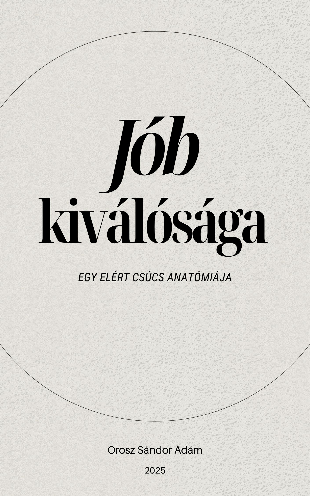

[← Vissza a főoldalra](/)

# Jób kiválósága 
## Egy elért csúcs anatómiája

**Szerző:** Orosz Sándor Ádám  
**Publikáció dátuma:** 2025. július 19.  
**Licenc:** Creative Commons CC BY 4.0  
**DOI:** [https://doi.org/10.5281/zenodo.16143095](https://doi.org/10.5281/zenodo.16143095)
---

## 📄 Letöltés

- **PDF (Zenodo):** [Letöltés](https://doi.org/10.5281/zenodo.16143095)

## Összefoglaló

A vizsgálat kiindulópontja nem Jób szenvedése vagy a válaszkeresése, hanem az a kivételes állapot, amelyben a próba előtt volt. A tanulmány arra keresi a választ, mitől lehetett Jób ennyire kiemelkedő, és honnan szerezhette azt az ismeretet, amely ilyen életvitelhez vezetett. A tanulmány nemcsak Jób hitének belső tartalmát és istenképét vizsgálja, hanem azt is részletesen feltárja, hogyan formálódott ez a hit praxissá egy olyan korban, ahol mindez nem volt előírva vagy szabályozva.

  

## 🧭 Tartalomjegyzék

---

## Tartalomjegyzék

- [1. Bevezetés](#1-bevezetés)
- [2. Jób profilja a próba előtt](#2-jób-profilja-a-próba-előtt)
- [3. Az ismeret és a hit forrásai](#3-az-ismeret-és-a-hit-forrásai)
- [4. Hit a gyakorlatban](#4-hit-a-gyakorlatban)
- [5. A kapcsolat dinamikája](#5-a-kapcsolat-dinamikája)
- [6. Jób maximumának szintézise](#6-jób-maximumának-szintézise)
- [7. Konklúzió és tanulságok ma](#7-konklúzió-és-tanulságok-ma)
- [Irodalomjegyzék](#irodalomjegyzék)

---

# 1. Bevezetés

### A. Kiindulópont: Az isteni mérce (Jób 1:8)

A Szentírás lapjain számos kiemelkedő alak történetével találkozunk, akik hitükkel, tetteikkel vagy éppen küzdelmeikkel hagytak nyomot az utókor számára. Közülük is különleges helyet foglal el Jób, Úz földének igaz embere. Történetének legismertebb eleme a hirtelen jött, felfoghatatlan mértékű szenvedés, valamint az arra adott válasza: a barátokkal és Istennel folytatott küzdelmes párbeszéd. Mielőtt azonban ez a drámai fordulat bekövetkezett volna, Jób élete egy Istennek tetsző kiválóság állapotát tükrözte. Feddhetetlenségét, igazságosságát és istenfélelmét nem csupán a narrátor állapítja meg (Jób 1:1), hanem maga Isten is a lehető legmagasabb szinten ismeri el, amikor az egész földön páratlannak nevezi őt szolgái között (Jób 1:8).

Ez a kiinduló állapot – a próbatételek *előtti* Jób – vet fel egy alapvető teológiai és hermeneutikai kérdést. Egy olyan korban, amely megelőzte a mózesi Törvény explicit kinyilatkoztatását[^1] és Jézus Krisztus megváltói művét, hogyan volt lehetséges elérni az istenfélelemnek és az erkölcsi integritásnak egy olyan szintjét, amelyet maga Isten tekintett a legmagasabbnak?

### B. A központi kérdés: Jób kiválóságának anatómiája

Jelen tanulmány középpontjában ez a kérdés áll. Nem elsősorban Jób szenvedéseinek teodíceai problémájára vagy az Újszövetséggel való részletes összehasonlítására törekszünk – bár ezek fontos témák –, hanem arra, hogy a Jób könyvének kanonikus formáját alapul véve, a szöveg saját bizonyságtételéből kiindulva feltárjuk:

* Milyen ismeretekkel rendelkezett Jób Istenről és az erkölcsi elvárásokról?
* Honnan származhattak ezek az ismeretek (a szöveg explicit vagy implicit utalásai alapján)?
* Milyen konkrét hitbeli meggyőződések jellemezték Jóbot?
* Hogyan manifesztálódott ez a hit a mindennapi életében, cselekedeteiben és kapcsolataiban?
* Milyen belső dinamika, milyen mechanizmusok működtek Jób életében, amelyek lehetővé tették számára ennek a kivételes állapotnak az elérését és fenntartását?

Célunk tehát Jób Isten által elismert kiválóságának anatómiai vizsgálata: azoknak a tényezőknek az azonosítása és elemzése, amelyek a kanonikus szöveg tanúsága szerint hozzájárultak ahhoz, hogy „feddhetetlen és igaz” emberré váljon.

### C. A vizsgálat módszertana

Jelen tanulmány egy tudatosan megválasztott hermeneutikai keretrendszert követ, amelynek alapja a **kánon hermeneutikai elsőbbsége**. A vizsgálat tárgya a Jób könyvének végső, kanonikus szövege, amelyet a protestáns hagyomány 66 könyvének kontextusában, egységes és belsőleg koherens kinyilatkoztatás részeként értelmezünk.

Az elemzés sorrendje a szűkebb egységtől halad a tágabb felé: **perikópa → könyv → kánon**. A következtetések levonásakor a bizonyítékok hierarchiáját alkalmazzuk: elsődleges súllyal a szöveg explicit kijelentései bírnak, amelyeket a belőlük levonható logikus következtetések követnek. A hallgatásra alapozott érvelést (argumentum ex silentio) csupán kiegészítő hipotézisként kezeljük. Célunk az **exegézis:** a szöveg eredeti, belső jelentésének feltárása a releváns filológiai eszközök (BHQ, LXX, lexikonok) segítségével, tudatosan kerülve a saját előfeltevések szövegbe vetítését. A történeti-kritikai és egyéb külső segédtudományok eredményeit a kanonikus szöveg megértését szolgáló, de annak alárendelt eszközként használjuk.

A módszertan részletes kifejtését és teológiai megalapozását lásd: Orosz Sándor Ádám, [*Hermeneutikai alapvetés: A felelősségteljes bibliatanulmányozás rendszerezett módszertana*](https://oroszsandoradam.github.io/tanulmanyok/hermeneutika/).

### D. Cél és szerkezet

E módszertani keretrendszer következetes alkalmazásával a tanulmány célja, hogy a Jób könyvéből kiindulva, annak saját terminológiáját, explicit kijelentéseit és belső összefüggéseit vizsgálva rekonstruálja Jób istenismeretének és igaz életének alapjait és dinamikáját.

A tanulmány szerkezete ezt a célt követi:

* **2. fejezet:** Jób kiinduló állapotát elemzi a Jób 1:1 és 1:8 alapján, filológiai pontossággal meghatározva a vizsgálat tárgyát.
* **3. fejezet:** Jób istenismeretének lehetséges forrásait és hitbeli meggyőződéseinek tartalmát kutatja a szöveg utalásai mentén, különös tekintettel a „hallás” (Jób 42:5) szerepére.
* **4. fejezet:** Azt vizsgálja, hogyan öltött testet ez a hit Jób konkrét életvitelében, elsősorban a Jób 29. és 31. fejezeteiben található ártatlansági esküjének műfajspecifikus elemzésével.
* **5. fejezet:** Jób és Isten kapcsolatának dinamikáját elemzi a szenvedés alatti párbeszéd és Isten végső értékelése (Jób 42:7, a *nəkônâ* kifejezés) fényében.
* **6. fejezet:** Összefoglalja Jób „maximumának” összetevőit a kanonikus szöveg bizonysága alapján.
* **7. fejezet:** Levonja a történet tanulságait a mai Istent kereső ember számára.

Reményeink szerint ez a szövegközpontú, módszertanilag tudatos megközelítés hozzájárul Jób történetének egy árnyaltabb és mélyebb, a Szentírás tekintélyét tiszteletben tartó megértéséhez.

# 2. Jób profilja a próba előtt

Ahhoz, hogy Jób kiválóságának anatómiáját feltárjuk, az elemzést a kanonikus szöveg legelső, alapvető kijelentéseinél kell kezdenünk. A Jób könyvének bevezető narratívája egy rendkívül tömör, mégis súlyos profilt vázol fel főhőséről. Ez a leírás, amelyet a Jób 1:1-ben a narrátor, majd a Jób 1:8-ban maga Isten fogalmaz meg, képezi vizsgálatunk kiindulópontját és mércéjét.

### A. Textuális és filológiai elemzés

A könyv narrátora így mutatja be Jóbot:

Élt Úc földjén egy Jób nevű ember. Feddhetetlen és becsületes ember volt, félte az Istent, és kerülte a rosszat. (Jób 1:1 RÚF 2014).

 Ezt a négy jellemzőt Isten a mennyei tanácsban szó szerint megismétli, amikor a Sátán figyelmébe ajánlja szolgáját (Jób 1:8). A bizonyítékok hierarchiája szerint ez a lehető legerősebb alap: egy emberi (narrátori) és egy isteni tanúságtétel, amely tökéletesen egybevág.

Mielőtt a kifejezések jelentését részleteznénk, fontos szövegkritikai megjegyzést tenni: a Jób 1:1 és 1:8 héber szövege a maszoréta hagyományban (MT, alapja a BHQ[^2]) rendkívül stabil. A Septuaginta (LXX) görög fordítása[^3], bár más szavakat használ, szemantikailag hűen tükrözi a héber eredeti mélyen pozitív értelmét. Nincs olyan jelentős szövegvariáns, amely megkérdőjelezné a Jób jelleméről alkotott képet.

Vizsgáljuk meg a négy héber kifejezést:

1. תָּם **(tām) – Feddhetetlen:** A szó gyökjelentése ‘teljes’, ‘ép’, ‘hiánytalan’. Erkölcsi kontextusban nem a bűn nélküli tökéletességre, hanem a belső integritásra, a jellem egységességére és őszinteségére utal.[^4] A *tām* ember az, akiben nincs kétszínűség, álnokság vagy rejtett motiváció. Az LXX fordítása, a *ἄμεμπτος (amemptos)*, ezt erősíti meg: ‘kifogástalan’, ‘megszólhatatlan’, ‘vádolhatatlan’.[^5] Ez tehát Jób belső, jellembeli állapotára vonatkozik.

2. יָשָׁר **(yāšār) – Igaz/Egyenes:** A szó alapja az ‘egyenes’, ‘sima’, ‘helyes’ jelentés. Olyan embert jelöl, aki „egyenes úton jár”, akinek viselkedése és cselekedetei összhangban vannak az igazság és a méltányosság normáival.[^6] Míg a *tām* a belső integritást, a *jāšār* a külső, megfigyelhető viselkedés helyességét hangsúlyozza. Az LXX itt a *δίκαιος (dikaios)* szót használja, ami ‘igazságos’, ‘törvényes’, a helyes rendnek megfelelő életvitelre utal.[^7]

3. יְרֵא אֱלֹהִים **(yǝrêʾ ʾĕlōhîm) – Istenfélő:** Szó szerint „féli az Istent”. A bibliai bölcsességirodalomban ez a kifejezés az istenfélő élet fundamentumát jelöli. Nem rettegő félelemre, hanem Isten szentsége iránti mély tiszteletre, hódolatra és az akaratához való engedelmes igazodás vágyára utal.[^8] Ez a tulajdonság adja Jób jellemének vertikális dimenzióját, a motivációt a feddhetetlenségre és igazságra. Az LXX a *θεοσεβής (theosebēs)* kifejezéssel adja vissza: ‘Istent tisztelő’, ‘kegyes’.[^9]

4. סָר מֵרָע **(sār mêrāʿ) – Bűngyűlölő / A rossztól elforduló:** Szó szerint ‘eltávozott a rossztól’. A *sār* a סור (*sûr*, ‘elfordulni’) ige aktív particípiuma, amely egy tudatos, folyamatos cselekvést és magatartást fejez ki.[^10] Jób nemcsak passzívan kerüli a rosszat, hanem aktívan elfordul tőle, távol tartja magát mindattól, ami gonosz. Ez a negyedik jellemző a gyakorlati megvalósulása az előző háromnak: az istenfélelemből fakadó belső integritás és külső igazság konkrét tettekben, a rossz elutasításában nyilvánul meg. Az LXX fordítása is ezt az aktív elkerülést hangsúlyozza: *ἀπεχόμενος ἀπὸ παντὸς πονηροῦ πράγματος (apechomenos apo pantos ponērou pragmatos)*, azaz ‘tartózkodva minden gonosz dologtól/tettől’.[^11]

### B. A jellemzők szintézise

Ez a négy, gondosan megválasztott kifejezés nem pusztán egy lista, hanem egy kumulatív hatású, holisztikus jellemrajz. Együtt egy átfogó képet festenek Jóbról:

* **Belsőleg** egységes és őszinte (*tām*).
* **Külső cselekedeteiben** egyenes és igazságos (*yāšār*).
* **Istennel való kapcsolatában** tisztelettudó és engedelmes (*yǝrêʾ ʾĕlōhîm*).
* **A gonosszal szembeni magatartásában** aktívan elutasító és távolságtartó (*sār mêrāʿ*).

Ez a leírás egy olyan ember portréja, akinek hite, jelleme és cselekedetei teljes harmóniában állnak egymással. A kanonikus szöveg szerint Jób ebben az állapotban volt a történet kezdetén.

### C. Az isteni értékelés

A jellemzés súlyát és hitelességét drámaian megnöveli, hogy azt Isten maga erősíti meg a mennyei színen, a Sátán előtt (Jób 1:8). Isten explicit szavai nemcsak validálják a Jób 1:1-ben olvasottakat, hanem a bizonyítékok hierarchiájának csúcsán állva egy döntő elemmel egészítik ki azt: **„Mert nincsen hozzá hasonló a földön...”** (כִּי אֵין כָּמֹהוּ בָּאָרֶץ - *kî ʾên kāmôhû bāʾāreṣ*).

Ez az isteni kijelentés több, a tanulmányunk szempontjából alapvető implikációval bír:

1. **Páratlanság:** Jób nem csupán egy volt a sok igaz ember közül; Isten szemében ő volt a kiemelkedő példa, az etalon, a legmagasabb mérce a saját korában és kontextusában.
2. **Isteni elégedettség:** Isten nemcsak tudomásul veszi Jób állapotát, hanem szavai „elégedettséget” sugallnak, és mintegy „büszkén” mutatja be őt mint szolgáját a mennyei tanács előtt.
3. **A vizsgálat alapja:** Ez az isteni értékelés jelöli ki azt a szintet, amelynek az anatómiája a jelen tanulmány célja. Ha Isten szerint Jób elérte a korabeli emberi maximumot az istenfélelemben és integritásban, akkor a hermeneutikai feladatunk az, hogy a szövegből kiindulva megvizsgáljuk, hogyan jött létre és miben állt ez a kiválóság.

Összefoglalva tehát, a Jób könyvének kezdő versei egy olyan ember profilját rajzolják meg, aki a rendelkezésére álló ismeretek és lehetőségek között elérte az emberi integritás és istenfélelem csúcsát, amit maga Isten is a legmagasabb szinten ismert el. Ez a kivételes kiinduló állapot adja meg a hátteret és a tétet a könyv további eseményeihez, és ez képezi vizsgálódásunk szilárd, textuális alapját.

# 3. Az ismeret és a hit forrásai

Miután a 2. fejezetben a kanonikus szöveg explicit kijelentései alapján megállapítottuk, hogy Jób a próbatételek előtt a kiválóság egy Isten által is elismert szintjén állt, felmerül a hermeneutikai szempontból is alapvető kérdés: mi tette ezt lehetővé? Milyen ismeretekre és meggyőződésekre épült ez az állapot? Ez a fejezet azt vizsgálja, hogy a Jób könyvének szövege milyen utalásokat tartalmaz Jób istenismeretének forrásaira és hitének konkrét tartalmára vonatkozóan.

### A. A „hallott szó” (Jób 42:5)

Jób történetének végén, amikor Isten közvetlenül megszólítja őt a forgószélből, Jób maga adja meg a kulcsot korábbi istenismeretének természetéhez. Ez a legerősebb, explicit bizonyítékunk:

Az én fülemnek hallásával hallottam felőled [שְׁמַע-אָזְנִי שְׁמַעְתִּיךָ - *šəmaʿ-ʾoznî šəmaʿtîḵā*], de most szemeimmel látlak téged.
(Jób 42:5).

Ez a kijelentés egy alapvető megkülönböztetést tesz: a korábbi, „halláson” alapuló tudás és az új, közvetlen, személyes tapasztalaton („szemmel látás”) alapuló megértés között. Ebből logikusan következik, hogy Jób kiváló élete nem általános sejtéseken vagy csupán a természet megfigyelésén alapult, hanem egy konkrét, **közvetített, „hallott” üzeneten vagy ismeretanyagon.**

#### 1. Lehetséges források feltárása

A kanonikus szöveg nem részletezi ennek a „hallott szónak” a pontos eredetét. Ezen a ponton a hermeneutikai alázat megköveteli, hogy amit a szöveg nem állít, azt mi se tegyük. Azonban a szöveg egyéb utalásai és a kánon egészének kontextusa alapján felvázolhatunk néhány megalapozott, textuális adatokkal alátámasztott hipotézist:

* **Hipotézis 1: Pátriárkai kor és az abból fakadó szóbeli hagyomány.**
    A „hallott szó” valószínű forrása egy olyan szóbeli hagyomány, amely abban a pátriárkai korban virágzott, ahová a könyv belső jellegzetességei Jóbot helyezik. A bizonyítékok tehát nem csupán a kort datálják, hanem azt a kulturális közeget is felvázolják, amelyben a szájhagyomány volt a vallási ismeretek elsődleges átadásának módja.

  * **A Hagyományra való explicit hivatkozás:**
      A könyvön belül maguk a szereplők is a „régiek tudására” mint autoritásra hivatkoznak. Bildád érvelése tökéletesen példázza a hagyomány-alapú gondolkodást:

      Kérdezd csak meg a régi nemzedéket, és jegyezd meg, amit atyáik kitapasztaltak! Nemde ők tanítanak, ők mondják meg neked, és szívük mélyéből hozzák elő a szavakat? (Jób 8:8, 10)

      Ez közvetlen, szövegen belüli bizonyíték arra, hogy Jób világában a „hallott szó” – az atyáktól átvett tapasztalat és tudás – központi szerepet játszott.

  * **Ősidők ösvénye és az özönvíz emlékezete:**
      Elifáz is felidézi a hajdani nemzedékeket – külön kiemelve azt, amelyet az özönvíz pusztított el:

      Az ősidők ösvényét akarod követni, amelyet álnok emberek tapostak, akik időnap előtt ragadtattak el, és alapjukat elmosta az ár? (Jób 22:15–16)

      Az „ősrégi ösvény” kifejezés és az árvízre utalás arra mutat, hogy az özönvíz előtti ítélet története is a korabeli hagyomány szerves része volt – s így Jób és barátai is ismerték.

  * **A pátriárka mint a hagyomány őrzője:**
      Jób családfői papi szerepe (Jób 1:5) nemcsak a Törvény előtti korra utal, hanem arra is, hogy a családfő volt a vallási tudás és gyakorlat letéteményese és továbbadója. Az áldozat bemutatása (vö. Noé: *Gen 8:20*; Ábrahám: *Gen 22:13*) nem rögtönzés, hanem egy **átvett, megtanult** rítus, amely a szóbeli hagyomány részét képezte.

  * **Közös teológiai motívumok:**
      Jób istenismeretének alapvető elemei – a szuverén, egyetlen Teremtő Isten, az emberiség közös eredete (Jób 31:15), a bűn súlya és az engesztelő áldozat szükségessége (Jób 1:5) – erős párhuzamot mutatnak a Genezis pátriárkai elbeszéléseivel (vö. *Gen 1–2*; *Gen 8:20*). Mindez azt jelzi, hogy Jób egy közös, Sínai előtti hagyományáramlatból merített, amely szájhagyomány útján terjedt.

* **Hipotézis 2: Specifikusabb isteni kijelentés.**
      A „hallott szó” utalhat egy általános hagyományon túlmutató, konkrétabb isteni üzenetre is. Bár a szöveg nem ír Jób próbatételek előtti közvetlen kijelentésről, a könyv világképétől nem idegen az ilyen tapasztalat.
  * **Teológiai mélység:** Jób hitének néhány eleme, különösen a személyes Megváltóba (*gōʾêl*) vetett reménysége (Jób 19:25), egy olyan teológiai belátást tükröz, amely meghaladja a korabeli általános istenismeret szintjét, és felveti egy specifikusabb tanítás lehetőségét.
  * **A kijelentés mint lehetőség:** Elifáz leírása egy éjszakai, természetfeletti üzenetről (Jób 4:12–17) bizonyítja, hogy a könyv narratívájában a közvetlen isteni kommunikáció valós lehetőségként jelenik meg. Nem zárható ki, hogy Jób vagy felmenői is részesültek hasonló, de a szövegben nem részletezett „hallott” üzenetekben.

* **Hipotézis 3: Természet, lelkiismeret és a „hallott szó” kombinációja.**
      A legvalószínűbb, hogy Jób istenismerete több forrásból, egymást erősítve táplálkozott. A „hallott” hagyományt megerősíthették a tapasztalati források, amelyeket a szöveg maga is hangsúlyoz.

  * **A Teremtett Világ Bizonyságtétele:** Jób maga hivatkozik arra, hogy a teremtett világ tanúskodik Alkotójáról:
  
    De kérdezd csak meg a barmokat, és megtanítanak, az ég madarait, és megmondják neked. ... Ki ne tudná mindezekből, hogy az ÚR keze alkotta-e ezeket? (Jób 12:7–9).

    Isten végső válasza (Jób 38–41) is szinte teljes egészében a teremtés rendjére épül mint az isteni bölcsesség bizonyítékára. Ez a gondolat tökéletesen egybevág azzal a kanonikus elvvel, amelyet Pál apostol fogalmaz meg, miszerint Isten láthatatlan tulajdonságai – örök ereje és istensége – a világ teremtésétől fogva alkotásainak értelmes vizsgálata révén megláthatók (vö. Róm 1:19–20).

  * **A Lelkiismeret Szava:** Jób híres ártatlansági esküje (Jób 31) egy rendkívül fejlett belső erkölcsi iránytűről tanúskodik. Itt nem külső törvényekre, hanem saját tetteinek és motivációinak belső vizsgálatára hivatkozik (pl. a buja tekintet elkerülése: 31:1; a szegényekkel való méltányos bánásmód: 31:16–23). Ez összhangban áll a kánon általános elvével, amely szerint a törvény cselekedete a szívbe van írva, amiről a lelkiismeret is tanúbizonyságot tesz (vö. Róm 2:14–15).

Látjuk, hogy Jób ismerete nem volt üres vagy homályos, hanem egy konkrét, „hallott” tartalommal bírt, amelyet a teremtés rendje és a lelkiismeret szava is megerősített, és amelyre aktív hittel válaszolt. A Zsidókhoz írt levél teológiai elve, bár egy későbbi kinyilatkoztatási korban íródott, jól megragadja ezt a dinamikát: *„Hit nélkül pedig lehetetlen Istennek tetszeni; mert aki Isten elé járul, hinnie kell, hogy ő létezik és megjutalmazza azokat, akik őt keresik.”* (Zsid 11:6).[^12] Jób élete ennek az aktív, kereső hitnek a mintapéldája volt.

### B. A hit tartalmi elemei

A Jób könyvének szövegéből – elsősorban Jób saját szavaiból – több, explicit bizonyítékon alapuló tartalmi elem is kiolvasható, amely a „hallott” és hitt igazság részét képezhette:

1. **Istenkép:** Jób hitt egy személyes, szuverén Istenben (akit a szöveg több néven is említ: *Eloah, El Shaddai, YHWH*). Hitt abban, hogy Isten a Teremtő, aki minden embert egyformán alkotott („*Avagy nem ő alkotott-é engem is az anyaméhben?*” - Jób 31:15), Ő az, aki ad és elvesz mindent szuverén módon (Jób 1:21), és végső soron Ő igazságos, még ha útjai kifürkészhetetlenek is.

2. **Etikai tudatosság és a bűn valósága:** Jób tisztában volt a bűn Isten előtti súlyával, amely túlmutatott a külső tetteken. Ez abból a rendkívüli tényből is nyilvánvaló, hogy aggódott fiai esetleges *gondolati* bűnei miatt is („*Hátha vétkeztek a fiaim, és káromolták Istent szívükben.*” - Jób 1:5). Életét folyamatosan az igazság mércéjéhez mérte (lásd a 4. fejezetben elemzett Jób 31-et).

3. **Engesztelés és áldozat:** Jób nemcsak tudott a bűnről, hanem ismerte és rendszeresen gyakorolta az égőáldozat bemutatását (Jób 1:5). Ez egy explicit cselekedet, amely arra utal, hogy hitt az áldozat engesztelő vagy legalábbis Istennel való kapcsolatot helyreállító, megelőző erejében.

4. **Jövőkép és a személyes megváltó reménysége:** Jób hite túlmutatott a földi életen. Legismertebb hitvallása egy rendkívül specifikus és teológiailag mély reménységről tanúskodik:

Mert én tudom, hogy az én Megváltóm [גֹּאֲלִי - *gōʾălî*] él, és utoljára megáll a por fölött. És miután ezt a bőrömet megrágják, testemben látom meg Istent. (Jób 19:25–26).

(Megjegyzendő, hogy a héber nyelvtan alapján a kifejezés a 'testemtől távol, testem nélkül' olvasatot is megengedi, amely mellett több modern kommentátor érvel. Tanulmányunk a „testemben látom meg Istent” olvasatot követi, amelyet a LXX, a Vulgata és a patrisztikus hagyomány egyaránt támogat.)

A *gōʾēl* kifejezés egy jogi terminus, amely a legközelebbi rokont jelöli, akinek kötelessége volt a rokon jogait helyreállítani, kiváltani a szolgaságból vagy megbosszulni a halálát.[^13] Jób ebben az ősi, a mózesi Törvény által később kodifikált, de a pátriárkák korában is létező jogi-társadalmi intézményben[^14] látta meg a végső isteni Jogvédőjének modelljét. Hite szerint van egy ilyen isteni „Jogvédője”, aki a halála után igazolni fogja őt, és aki lehetővé teszi számára, hogy meglássa Istent. Ez az eszkatologikus értelmezés, bár vitatott, a szöveg mélységének egyik legkonzisztensebb olvasata.[^15]

### C. Összegzés: A belső hajtóerő

Jób kiválóságának alapja tehát nem egy általános, homályos vallásosság volt. A kanonikus szöveg tanúsága szerint egy „hallott szón” alapuló, konkrét tartalmi elemekkel (Isten szuverenitása, a bűn valósága, az engesztelés szükségessége, a jövőbeli reménység) rendelkező ismeret vezérelte. Ez az ismeret egy aktív hitet és Isten keresését váltotta ki benne, amely az egész életét áthatotta és motiválta. A következő fejezet azt vizsgálja meg részletesen, hogyan öltött testet ez a hit Jób mindennapi gyakorlatában.

# 4. Hit a gyakorlatban

A 3. fejezetben láttuk, hogy Jób istenismerete egy „hallott szón” alapult, amely konkrét hitbeli meggyőződéseket formált benne Istenről, a bűnről, az engesztelésről és a reménységről. Azonban a Jób könyve alapján ez a hit nem maradt elvont, teoretikus szinten. Jób kiválóságának egyik kulcsa éppen az volt, hogy ezek a belső meggyőződések következetesen megnyilvánultak a gyakorlati életvitelében. Jób szenvedései közepette visszatekint korábbi életére a 29. és különösen a 31. fejezetben, amely egyedülálló betekintést nyújt abba, mit jelentett számára a „feddhetetlen, igaz, istenfélő és bűngyűlölő” élet a mindennapokban.

### A. Műfaji elemzés: Az ártatlansági eskü

A Jób 31. fejezet egy specifikus ókori keleti irodalmi formát, az **ártatlansági esküt** vagy **negatív hitvallást** képviseli. Ilyen szövegeket ismerünk például az egyiptomi *Halottak Könyve* 125. fejezetéből, ahol az elhunyt felsorolja azokat a rituális és morális vétségeket, amelyeket *nem* követett el, hogy beléphessen a túlvilágra.[^16] Míg a párhuzam formai, a tartalom és a motiváció jelentősen különbözik: Jób esküje a belső tisztaságra (pl. gondolatok, tekintet) helyezett hangsúllyal és a közös Teremtőben gyökerező etikai felelősséggel mélységében felülmúlja a korabeli analógiákat. A műfaj felismerése azért meghatározó, mert jelzi: Jób nem büszkélkedik, hanem a legszentebb formulákkal, önátkot is vállalva (pl. 31:8, 10, 22) tesz esküt Isten és ember előtt saját integritásáról. Ez az ő végső jogi védekezése, amelyben életét bizonyítékként tárja fel.

### B. A megélt etika területei

A 31. fejezet szisztematikusan végigveszi az élet különböző területeit, bemutatva, hogyan vált a hit cselekedetté. Az alábbiakban elemezzük ezeket a legfontosabb területeket.

#### 1. Társadalmi felelősségvállalás: Igazságosság és irgalom

Jób nem volt közömbös a körülötte élők szenvedése iránt. Tudatosan kereste a lehetőséget, hogy segítsen a kiszolgáltatottakon.

* **Explicit kijelentések:** *„Megmentettem a kiáltó szegényt, és az árvát, akinek nem volt segítsége.”* (29:12); *„Szeme voltam a vaknak, és lába a sántának.”* (29:15); *„Összetörtem a gonosznak állkapcsát, és fogai közül kiragadtam a prédát.”* (29:17); *„Ha megtagadtam a szegények kívánságát... ha ettem falatomat egymagam, hogy az árva abból nem evett...”* (31:16-17); *„Ha láttam, hogy elveszett a ruhátalan... és nem melegítette meg magát juhaim gyapjával...”* (31:19-20).
* **Következtetés:** Jób igazsága (*yāšār*) nemcsak a rossz elkerülését jelentette, hanem aktív cselekvést a gyengék és elnyomottak érdekében. Ez az etika mélyen gyökerezik az Isten által elvárt irgalomban és igazságosságban, amely a későbbi Törvényben, a prófétai irodalomban (pl. Mikeás 6:8) és az Újszövetségben is központi elem.

#### 2. Személyes etika: Tisztaság, hűség, önkontroll

Jób a személyes életében is rendkívül magas mércét állított, kiterjesztve azt a gondolatokra és a tekintetre is.

* **Explicit kijelentések:** *„Szövetséget kötöttem szememmel, hogy ne tekintsek szűz leányra.* (31:1); *„Ha léptem hazugságra fordult, és ha lábam álnokságra sietett...”* (31:5); *„Ha szívem asszony után bomlott, és ha leselkedtem felebarátom ajtaján...”* (31:9).
* **Következtetés:** Jób feddhetetlensége (*tām*) a belső tisztaságra és az önfegyelemre is kiterjedt. Tudatosan törekedett arra, hogy elkerülje nemcsak a nyilvánvaló bűnöket (pl. házasságtörés), hanem azok gyökerét, a buja tekintetet és a gonosz vágyat is. Ez a gondolati szintű etika előrevetíti a Hegyi Beszéd tanítását (Máté 5:28).

#### 3. Emberi kapcsolatok: Méltányosság az alárendeltekkel

Jób magas társadalmi státusza ellenére nem tekintette magát felsőbbrendűnek, még rabszolgáival szemben sem.

* **Explicit kijelentés:** *„Ha megvetettem szolgám vagy szolgálóm ügyét, amikor pereltek velem... Nemde ugyanaz alkotott engem is az anyaméhben? Nem ugyanaz formált bennünket az anyaméhben?”* (31:13, 15).
* **Következtetés:** Jób istenismerete (a közös Teremtőbe vetett hit) közvetlen etikai következménnyel járt. Ez a meggyőződés – hogy minden ember egyenlő a Teremtő előtt – méltányos és emberséges bánásmódra indította még az alárendeltjeivel szemben is. Az a tény, hogy elismerte szolgái jogát a panaszra, radikálisan eltért a korabeli társadalmi normáktól, amelyek a szolgát alapvetően a gazdája tulajdonának tekintették.[^17]

#### 4. Isten elsőbbsége a vagyon és a teremtett világ fölött

Bár rendkívül gazdag volt, Jób nem a vagyonába vetette a bizalmát.

* **Explicit kijelentések:** *„Ha reménységemet aranyba vetettem, és azt mondtam a színaranynak: Én bizodalmam!... Ha örvendeztem, hogy nagy a gazdagságom...”* (31:24-25). Továbbá az asztrális kultuszoktól is elhatárolódott: *„Ha néztem a napot... és a holdat... És titkon elcsábult a szívem... Ez is büntetésre méltó vétek; mert megtagadtam volna Istent odafenn.”* (31:26-28).
* **Következtetés:** Jób istenfélelme (*yǝrêʾ ʾĕlōhîm*) azt jelentette, hogy Isten maradt számára a legfőbb érték és bizodalmának alapja, nem pedig a földi javak vagy a teremtett világ elemei. Tudatosan elutasította a bálványimádás két leggyakoribb formáját: a mammon és a természet imádatát.

#### 5. Integritás és vendégszeretet

Jób hangsúlyozta őszinteségét és a rászorulók felé tanúsított nyitottságát.

* **Explicit kijelentések:** *„Az idegen nem hál az utcán; ajtóimat a vándor előtt megnyitottam.”* (31:32); *„Ha eltitkoltam, mint Ádám [כְּאָדָם - *kə-ʾādām*], vétkeimet, elrejtve keblembe bűnömet...”* (31:33).
* **Következtetés:** Jób élete a vendégszeretet jegyében telt, és elutasította a képmutatást. A *kǝʾādām* kifejezés fordítása vitatott: jelentheti azt, hogy „emberi módon / mint más emberek”, de a legtöbb modern fordítás és kommentár a valószínűbb „mint Ádám” olvasatot részesíti előnyben.[^18] Ebben az esetben ez egy erős kanonikus kapcsolódási pont a teremtéstörténethez (Gen 3:8-10), amely a bűn elrejtésének őstípusát idézi fel, amellyel Jób a saját átláthatóságát állítja szembe.

### C. Engedelmesség: A hit igazolása

A Jób 29. és 31. fejezetekben bemutatott életvitel nem csupán erkölcsi kiválóságot demonstrál, hanem Jób hitének és Istennel való kapcsolatának kézzelfogható, empirikus bizonyítéka. Az ő esetében a „hallott szó” nem maradt meg az elméjében, hanem lefordítódott konkrét, következetes cselekedetekre. Ez a hitből fakadó engedelmesség támasztja alá és teszi hitelessé a 2. fejezetben elemzett, Isten által is megerősített jellemzést. Élete igazolta a belső meggyőződéseit. Jób kiválóságának anatomiája tehát a hit és a cselekedetek elválaszthatatlan egységében rejlik.

# 5. A kapcsolat dinamikája

Jób történetének egyik legmeglepőbb és teológiailag legmélyebb pontja Isten végső ítélete Jób és barátai párbeszédéről. Miután a barátok hosszú, költői beszédekben, egy merev dogmatikus teológia alapján próbálták megmagyarázni Jób szenvedését – azt állítva, hogy a szenvedés mindig a bűn közvetlen következménye –, Jób válaszaiban hol Istent vádolta, hol kétségbeesetten kereste vele a párbeszédet. Végül Isten így szólt Elifázhoz:

Felforrott az én haragom ellened és két barátod ellen, mert nem szóltatok rólam igazán/helyesen (נְכוֹנָה - *nǝkônâ*), mint az én szolgám, Jób. (Jób 42:7b).

Ez a kijelentés, amely a bizonyítékok hierarchiájának csúcsán álló isteni verdikt, első olvasatra zavarba ejtő hermeneutikai dilemmát teremt. Hogyan lehetett Jób néha keserű, vádaskodó, Istent perbe hívó beszéde „helyesebb” Isten szemében, mint a barátoké, akik látszólag Isten igazságosságát és hatalmát védelmezték? A válasz a *nəkônâ* kifejezés pontosabb filológiai megértésében és a párbeszédek kontextusának elemzésében rejlik.

### A. A „helyes beszéd” dilemmája

A héber נָכוֹן (*nākôn*) (itt a נְכוֹנָה - *nǝkônâ* nőnemű alakban) gyökjelentése ‘szilárd’, ‘megalapozott’, ‘biztos’, ‘kész’, ‘helyes’, ‘igaz’.[^19] Nem pusztán a ténybeli pontosságot jelenti, hanem a helyzethez illő, megfelelő, hiteles beszédet is. Isten ítélete szerint a barátok beszéde *nem* volt *nəkônâ*, míg Jóbé *igen*. Ez a megkülönböztetés adja a kulcsot a fejezethez. Az elemzés feladata annak feltárása, hogy miben állt a barátok beszédének helytelensége és Jóbé helyessége.

### B. A barátok beszédének problémái

Bár a barátok sok teológiailag *tényszerűen helyes* állítást tettek Isten hatalmáról és bölcsességéről, beszédük a konkrét szituációban mégis hamisnak és helytelennek bizonyult. A szöveg és a kontextus alapján több okot is azonosíthatunk:

1. **Merev és alkalmazhatatlan dogmatizmus:** A barátok egy zárt teológiai rendszert (a mechanikus retribúció elvét) erőltettek rá Jób helyzetére, figyelmen kívül hagyva a konkrét eset egyediségét, amelyről az olvasó tud, de ők nem (a mennyei tanács jelenete). Beszédük ugyan tartalmazott igaz elemeket, a konkrét szituációra alkalmazva hamis és sértő volt. A teológiai igazságok kontextus nélküli alkalmazása hazugsággá válik.
2. **Empátia és kapcsolati kontextus hiánya:** Vigasztalni érkeztek, de beszédük hamar ítélkezésbe és vádlásba fordult. Hiányzott belőle a valódi együttérzés, amit Jób többször is felró nekik (pl. Jób 13:4; 16:2; 19:21–22). Szavaikat fegyverként használták a szenvedő ember ellen, vigasz helyett további terhet okozva. Isten számára úgy tűnik, a „helyes” beszéd elválaszthatatlan a szeretettől és az empátiától.
3. **Isten karakterének torzítása:** Miközben Isten igazságosságát hangsúlyozták, egy egyoldalú, rideg, szinte kegyetlen képet festettek Istenről, aki gépiesen büntet. Ezzel Isten helyett egy teológiai dogmát védelmeztek, elárulva Isten valódi karakterét, akinek szuverén szabadsága és irgalma meghaladja a merev sémákat.

Fontos megjegyezni, hogy a barátok teológiai tételei (pl. Isten igazságossága) önmagukban a bölcsességirodalom részét képezték; a hibájuk ezen igazságok merev, empátia nélküli és a konkrét helyzetre való tekintet nélküli alkalmazásában rejlett.

### C. Jób beszédének hitelessége

Jób beszéde tele van fájdalommal, értetlenséggel, kérdésekkel, sőt, Istent igazságtalansággal vádoló kijelentésekkel is (pl. Jób 9:22–24). Miért ítéli ezt Isten mégis „helyesebbnek”?

1. **Őszinteség és hitelesség:** Jób nem rejtette véka alá valódi érzéseit és küzdelmeit. Beszéde – még ha néha tiszteletlennek is tűnt – hiteles volt. Nem próbált kegyesnek látszani, miközben belül tombolt a vihar. Isten ezt a kíméletlen őszinteséget többre értékelte, mint a barátok formális, de a valóságtól elrugaszkodott és érzéketlen „igazságait”.
2. **Kapcsolatkeresés:** Jób minden panasza, vádja és kérdése ellenére *Istennel* beszélt, *Istenhez* fordult. Nem tagadta meg Őt, és nem fordult el Tőle (ahogy a Sátán várta volna). Párbeszédet keresett, még ha az küzdelmes és perlekedő volt is. A barátok *Jóbról* és *Istenről* beszéltek (gyakran Jób ellenében), de nem Istennel. Jób beszéde a kapcsolat fenntartására irányult a legmélyebb válságban is.
3. **Alapvető bizalom megmaradása:** Jób értetlenül állt szenvedései előtt, de mélyen legbelül megmaradt a hite Isten alapvető jóságában és igazságában, amit a 3. fejezetben elemzett *gōʾêl*-reménység (Jób 19:25) is bizonyít. Beszéde ennek a küzdelmes, de meg nem tört bizalomnak a kifejeződése volt.
4. **Tanulásra és korrekcióra való nyitottság:** Jób beszéde ugyan tele volt vádakkal, mindvégig párbeszéd maradt. Ennek legfőbb bizonyítéka, hogy amikor Isten végre megszólal, Jób azonnal elhallgat, elismeri saját tudatlanságát, és alázattal fogadja a feddést (Jób 40:4–5; 42:1–6). Bár ez a belátás már a viták után következik be, mégis visszamenőleg igazolja Jób magatartásának hitelességét: ő valóban választ keresett, és amikor azt megkapta, hajlandó volt meghajolni előtte. A barátok ezzel szemben egy zárt rendszerből beszéltek, amely nem volt nyitott a korrekcióra.

### D. Az élő kapcsolat jelentősége

Isten ítélete (Jób 42:7) arra utal, hogy a számára ”helyes” beszéd nem csupán a ténybeli, dogmatikai pontosságot jelenti. A *nǝkônâ* fogalma magában foglalja a **hitelességet, a kapcsolatkeresést és az őszinteséget** is. A Jób könyvének drámája ebben a kontrasztban csúcsosodik ki:

| A barátok beszéde | Jób beszéde |
| :--- | :--- |
| Rendszer-védelem | Kapcsolat-keresés |
| Beszéd *Istenről* | Beszéd *Istenhez* |
| Teológiai ítélkezés | Fellebbezés Istenhez |
| Dogmatizmus | Korrekcióra nyitott párbeszéd |

Isten végső soron többre értékeli a küzdelmes, de élő, kapcsolatban maradó párbeszédet (mint Jóbét), mint a teológiailag talán „korrektebb”, de merev, érzéketlen és a kapcsolatot nem építő beszédet (mint a barátokét). Ez rávilágít arra, hogy Jób kiválósága nemcsak a próbatételek előtti tetteiben, hanem az Istennel való dinamikus, élő, még a legmélyebb próbákban is kitartó, hiteles kapcsolatában is megnyilvánult. Ez a dinamika Jób „maximumának” elengedhetetlen része.

# 6. Jób maximumának szintézise

Az eddigi fejezetekben a Jób könyvének kanonikus szövegét vizsgáltuk, célunk az volt, hogy feltárjuk azokat a tényezőket, amelyek hozzájárultak Jób kivételes, Isten által is elismert állapotához. Most, az elemzés végén összefoglaljuk Jób „maximumának” legfontosabb összetevőit.

### A. A kiválóság összetevői

Jób útja a kiválósághoz nem egyetlen tényezőre vezethető vissza, hanem több, egymást erősítő elem komplex szintézisére épült. Ezek az elemek, a bizonyítékok hierarchiája szerint, a következők:

1. **A „Hallott Szó” befogadása és komolyan vétele (Jób 42:5a):** Jób ismerete és hite nem a semmiből fakadt, hanem egy konkrét, „hallás” útján szerzett ismeretanyagon alapult. Noha ennek a „szónak” a pontos forrása rejtve marad (ezért a forrásokra vonatkozó elméletek hipotézisek maradnak), a létezése explicit tény. Ez a „hallott” ismeret magában foglalta Isten szuverenitásának, a bűn valóságának, az engesztelés szükségességének (Jób 1:5) és egy jövőbeli isteni igazolás reménységének (Jób 19:25) tudatát.

2. **Aktív hit és következetes engedelmesség (Jób 1:1, 1:8, 29., 31. fej.):** Jób nemcsak passzívan birtokolta ezt az ismeretet, hanem aktív hittel és engedelmességgel válaszolt rá. Az istenfélelem (*yǝrêʾ ʾĕlōhîm*) és a rossztól való elfordulás (*sār mêrāʿ*) együttesen írják le ezt a proaktív hozzáállást. Hite egy átfogó, minden életterületre kiterjedő életvitelben manifesztálódott: az igazságosság, irgalom, személyes tisztaság, méltányosság és az Istenbe vetett bizalom jellemezte cselekedeteit. Ez a hitből fakadó, következetes engedelmesség volt az, ami „igazzá” (*yāšār*) és „feddhetetlenné” (*tām*) tette Isten szemében.

3. **Dinamikus és hiteles kapcsolat Istennel (Jób 42:7):** Jób kapcsolata Istennel nem volt statikus vagy csupán formális. Még a legmélyebb szenvedés közepette is Istennel kereste a párbeszédet. Őszintesége, kitartó kapcsolatkeresése – még ha az küzdelmes és kérdésekkel teli volt is – hozzájárult ahhoz, hogy beszéde végül „helyesebbnek” (*nǝkônâ*) bizonyult Isten előtt, mint a barátok merev teologizálása. Ez egy élő, bár próbáknak kitett kapcsolat dinamikáját mutatja.

Összefoglalva, Jób maximuma a **rendelkezésére álló kinyilatkoztatásra („hallott szó”) adott teljes körű, integrált válaszban** rejlett. Ez a válasz magában foglalta az **aktív hitet**, a **következetes engedelmességet** az élet minden területén, és az **Istennel való őszinte, dinamikus kapcsolat** fenntartását a nehézségek közepette is.

### B. Az állapot ereje és korlátai

Jób által elért állapot ereje vitathatatlan, hiszen maga Isten ismerte el annak páratlanságát (Jób 1:8). Ez egy stabil, Istennek tetsző életet jelentett, amely képes volt ellenállni a kezdeti csapásoknak anélkül, hogy Jób Istent tagadta vagy káromolta volna (Jób 1:22; 2:10).

Ugyanakkor a kanonikus szöveg őszintén feltárja ennek az állapotnak a határait is. Fontos hangsúlyozni, hogy ezek nem a hit kudarcát jelentik, hanem az emberi lét és a Krisztus előtti kinyilatkoztatás természetes korlátait.

* **Az igazolás szükségessége:** Jób mélységesen vágyott arra, hogy Isten előtt tisztázhassa magát és igazolást nyerjen (pl. Jób 13:3; 23:3-7). Ez arra utal, hogy hitt az igazságában, a bizonyosság érzése azonban nem volt abszolút vagy megingathatatlan a szenvedés nyomása alatt. Az ő igazsága egy olyan állapot volt, amely külső, isteni megerősítésre szorult.

* **Isten útjainak korlátozott megértése:** Jób szenvedései rávilágítottak arra, hogy bár istenfélő volt, Isten szuverén útjait és céljait nem értette. Isten végső, a forgószélből elhangzó beszéde (Jób 38-41) éppen ezt a korlátozott emberi perspektívát állítja szembe Isten végtelen bölcsességével. Jób végül el is ismeri ezt: *„Tudatlanul beszéltem, csodás dolgokról, amelyeket nem értek.”* (Jób 42:3b).

* **A kapcsolat törékenysége a próbában:** Jób kitartott a kapcsolatban, de a szenvedés hatására megrendült a bizalma, és kemény vádakkal illette Istent. Ez arra mutat rá, hogy még a legőszintébb hit is sérülékennyé válhat, amikor a szenvedés mértéke felülmúlja a megértést, és a kapott világosság kevés a személyes tapasztalat értelmezéséhez.

### C. Jób példájának jelentősége

Jób története ebben az olvasatban azt mutatja be, hogy a hit, az engedelmesség és az Istennel való őszinte kapcsolat révén az ember – még a teljesebb újszövetségi kinyilatkoztatás ismerete nélkül is – elérhet egy olyan életet, amely Istennek tetsző és általa elismert. Jób példája egyfajta etalonja annak, mit jelentett egy korábbi kinyilatkoztatási szakaszban igaznak és istenfélőnek lenni. Az ő útja bizonyítja, hogy Isten keresi és értékeli az ember őszinte válaszát a neki adott világosságra, bármilyen formában is érkezzen az. Az elért állapot ereje és korlátai egyaránt hitelesen tükrözik az ember helyzetét Isten előtt.

# 7. Konklúzió és tanulságok ma

Jelen tanulmány Jób kiválóságának hátterét vizsgálta a Jób könyvének kanonikus szövegére támaszkodva, a bevezetőben ismertetett hermeneutikai keretrendszer következetes alkalmazásával. Célunk az volt, hogy feltárjuk azokat a tényezőket és dinamikákat, amelyek lehetővé tették Jób számára, hogy elérje azt az Isten által is elismert állapotot (Jób 1:8), amely a történet kiindulópontját képezi. Az elemzés főbb megállapításai és tanulságai a következők.

### A. A Tanulmány eredménye: Az elkötelezett élet modellje

A modell megmutatta, hogy Jób maximuma nem egy megmagyarázhatatlan, misztikus állapot volt, hanem egy három pilléren nyugvó, integrált életforma:

1. a rendelkezésre álló kinyilatkoztatásra való **figyelem**,
2. az abból fakadó, minden életterületre kiterjedő **engedelmesség**,
3. és az Istennel való dinamikus, hiteles **kapcsolat** fenntartása.

Lényegében Jób élete a **teljes szívből adott válasz** etalonjaként áll előttünk. A következő, időtlen tanulságok ebből a felismerésből fakadnak.

### B. Időtlen tanulságok: A Jób-modell kihívása ma

Bár Jób története egy specifikus történelmi és kinyilatkoztatási korban játszódik, az ő útja több időtlen tanulsággal is szolgál, amelyek erőteljes kihívást intéznek a mai, Istent kereső ember felé.

**1. A kinyilatkoztatás komolyan vételének mércéje**

Jób a rendelkezésére álló „hallott szóra”, egy korlátozott kinyilatkoztatásra építette fel egész életét. A mai hívő ezzel szemben a teljes Szentírás, Jézus Krisztus személyének és tanításának, valamint a Szentlélek vezetésének gazdagságát birtokolja. A kérdés: ha Jób ilyen szintre jutott a „szürkületben”, milyen mélységben veszi komolyan a modern ember a „déli verőfényt”? Válaszol-e olyan teljes körűen, olyan mindenre kiterjedő engedelmességgel a kapott, sokkal gazdagabb kinyilatkoztatásra?

**2. A hit és a tettek elválaszthatatlan egysége**

A Jób 31. fejezetének elemzése tükörként szolgál. Jób hite nem merült ki az áldozatok bemutatásában, áthatotta a társadalmi kapcsolatait (igazságosság a szegényekkel), a személyes etikáját (szövetség a szemével), a vagyoni viszonyait (nem bízott az aranyban) és az emberi méltóság tiszteletét (egyenlőnek látta magát a szolgáival). Ez erőteljes kihívás egy olyan korban, ahol a hitet könnyű a magánszférába vagy a vasárnap délelőttre korlátozni. Jób példája arra sarkall, hogy a hit minden döntésünkben és cselekedeteinkben megnyilvánuló, integrált életformává váljon.

**3. Az őszinte kapcsolat felszabadító ereje**

Talán a legerősebb üzenet a Jób 42:7 elemzéséből fakad: Isten többre értékeli a fájdalmában is Hozzá forduló, vele vitatkozó, őszinte Jób „helyes” beszédét, mint a barátok kegyesnek tűnő, de élettelen, empátia nélküli és személytelen dogmatizmusát. Isten egy hiteles kapcsolatot akar, nem egy vallásos színdarabot. Ez felszabadító üzenet mindazoknak, akik a kétségeikkel, a fájdalmukkal vagy akár a haragjukkal küzdenek Istennel szemben. Arra bátorít, hogy a valódi érzéseket ne rejtsük el kegyes frázisok mögé, hanem vigyük azokat őszintén Isten elé, mert az élő, dinamikus, akár küzdelmes kapcsolat értékesebb Isten szemében, mint a merev, formális vallásosság.

**4. A hűség lehetősége és értéke**

Jób története tisztán jelzi, hogy a hit nem mechanikus egyenlet, ahol a szenvedés a bűn automatikus következménye. Még részleges megértéssel és rendkívüli nyomás alatt is lehet tudatosan Istenhez ragaszkodni. Jób nem a várható jutalomért maradt hű, hanem azért, mert az Istennel való kapcsolat önmagában érték. Ez a szabadon vállalt engedelmesség ma is reményt ad: a legsötétebb körülmények között is dönthetünk úgy, hogy Istenre építünk, s ez a döntés önmagában felbecsülhetetlen.

**Összefoglalva:** ez a tanulmány több, mint egy ókori szöveg történelmi-teológiai elemzése. Egyfajta időtlen mintát vagy alaprajzot ad az élő hitről. A mai ember számára nemcsak bátorítást és reményt nyújt, hanem egy komoly kihívást és egy mélyebb, hitelesebb kapcsolatra való meghívást a Teremtővel.

### C. Záró gondolat

Jób maximumának anatómiája tehát nem a bűn nélküli tökéletesség, hanem az **elkötelezett élet** portréja. Példája nem csupán történelmi tanulság, hanem egy élő, időtlen mérce. A „hallott szó” szürkületében mutatott fel egy olyan integritást, amely a teljesebb kinyilatkoztatás „déli verőfényében” is kihívást jelent, és egyben reményt is ad.

Végső soron arra a felismerésre jutunk, hogy az Istennek tetsző élet titka nem a kapott világosság mennyiségében, hanem az arra adott válasz minőségében, őszinteségében és következetességében rejlik.

# Irodalomjegyzék

### Forrásszövegek és segédletek

Bauer, Walter, Frederick W. Danker, William F. Arndt, and F. Wilbur Gingrich. *A Greek-English Lexicon of the New Testament and Other Early Christian Literature*. 3rd ed. Chicago: University of Chicago Press, 2000. (Rövidítve: BDAG).

*Biblia Hebraica Quinta*. Stuttgart: Deutsche Bibelgesellschaft, 2004–. (Rövidítve: BHQ).

Koehler, Ludwig, and Walter Baumgartner. *The Hebrew and Aramaic Lexicon of the Old Testament*. Ford. és szerk. M. E. J. Richardson. Leiden: E.J. Brill, 1994–2000. (Rövidítve: HALOT).

Rahlfs, Alfred, and Robert Hanhart. *Septuaginta: Editio altera*. Stuttgart: Deutsche Bibelgesellschaft, 2006. (Rövidítve: LXX).

### Szakirodalom

Ash, Christopher. *Job: The Wisdom of the Cross*. Preaching the Word. Wheaton, IL: Crossway, 2014.

Clines, David J. A. *Job 21-37*. Word Biblical Commentary 18A. Dallas, TX: Word, Inc., 2006.

Dell, Katharine J., and Will Kynes, szerk. *The Oxford Handbook of Job*. Oxford: Oxford University Press, 2021.

Greenstein, Edward L. „The Book of Job and the Uniqueness of Israel.” In *The Oxford Handbook of Job*, szerk. Katharine J. Dell és Will Kynes, 583–596. Oxford: Oxford University Press, 2021.

Holtz, Shalom E. „Job and the Law.” In *The Oxford Handbook of Job*, szerk. Katharine J. Dell és Will Kynes, 435–448. Oxford: Oxford University Press, 2021.

Kynes, Will. „Introduction: The Book of Job in the 21st Century.” In *The Oxford Handbook of Job*, szerk. Katharine J. Dell és Will Kynes, 1–21. Oxford: Oxford University Press, 2021.

Orosz Sándor Ádám. [*Hermeneutikai alapvetés: A felelősségteljes bibliatanulmányozás rendszerezett módszertana*](https://oroszsandoradam.github.io/tanulmanyok/hermeneutika/). 2025. DOI: 10.5281/zenodo.15818855.

Seow, C. L. *Job 1-21: A New Translation with Introduction and Commentary*. Anchor Yale Bible 15. New Haven, CT: Yale University Press, 2013.

Seow, C. L. *Job 21-42: A New Translation with Introduction and Commentary*. Anchor Yale Bible 15A. New Haven, CT: Yale University Press, 2013.

# Végjegyzetek

[^1]: Jób korának a Sínai-szövetség előtti időszakra való helyezése a kanonikus szöveg belső jellegzetességein alapuló, széles körben elfogadott következtetés, amely a legújabb szakirodalmi konszenzust tükrözi. Lásd Will Kynes, „Introduction: The Book of Job in the 21st Century,” in *The Oxford Handbook of Job*, szerk. Katharine J. Dell és Will Kynes (Oxford: Oxford University Press, 2021), 4–5.
[^2]: *Biblia Hebraica Quinta*. Stuttgart: Deutsche Bibelgesellschaft, 2004–. (Rövidítve: BHQ).
[^3]: Alfred Rahlfs, and Robert Hanhart. *Septuaginta: Editio altera*. Stuttgart: Deutsche Bibelgesellschaft, 2006. (Rövidítve: LXX).
[^4]: Lásd HALOT, 1774. A תָּם (*tām*) szócikk a Jób 1:1-et az ‘integritás, feddhetetlenség’ jelentéskörébe sorolja.
[^5]: Lásd BDAG, 53. A ἄμεμπτος (*amemptos*) szócikk jelentései: ‘feddhetetlen, kifogástalan’.
[^6]: Lásd HALOT, 450. A יָשָׁר (*yāšār*) szócikk ‘igaz, egyenes, igazságos’ jelentéssel bír, különösen etikai értelemben, az isteni normáknak megfelelő viselkedésre utalva.
[^7]: Lásd BDAG, 249. A δίκαιος (*dikaios*) szócikk jelentése: ‘a normának megfelelő, igaz, igazságos’, amely az isteni és emberi igazságosságra egyaránt vonatkozik.
[^8]: Lásd HALOT, 437. A ירא (*yrʾ*) gyök alatt a vallási kontextusra fókuszáló 2. pont: ‘félelemmel tisztel, hódol, tiszteletet tanúsít (Isten iránt)’. Ez a tiszteletteljes félelem a bölcsesség alapja.
[^9]: Lásd BDAG, 451. A θεοσεβής (*theosebēs*) szócikk jelentése: ‘istenfélő, jámbor, kegyes’. A szó a kegyes, Isten iránti tiszteletet gyakorló embert írja le.
[^10]: Lásd HALOT, 747. A סור (*sûr*) gyök (Qal) 3. jelentése: ‘eltérni, elfordulni (a bűntől, a parancsoktól)’, tudatos tartózkodást kifejezve; a Jób 1:1 példaként szerepel.
[^11]: Lásd BDAG, 108. Az ἀπέχω (*apechō*) ige mediális alakjának (*ἀπέχομαι*) jelentése: ‘távol tartja magát, tartózkodik’; a jelen idejű particípium (*apechomenos*) folyamatos, szokásszerű magatartást fejez ki.
[^12]: A Zsidókhoz írt levél itt nem mint Jób ismeretének forrása, hanem mint a hit természetére vonatkozó, a kánon egészén átívelő teológiai alapelv illusztrációja szerepel.
[^13]: Lásd HALOT, 182. A גאל (*gāʾal*) ige jelentései között szerepel a „kiváltani, megváltani (rokonként)” és a „jogot érvényesíteni”.
[^14]: Ez az állítás a tudományos konszenzuson alapul. A téma legfrissebb jogtörténeti elemzése megerősíti, hogy a *gōʾêl* intézménye az ókori sémita szokásjogban gyökerezik, amelyet a Törvény később kodifikált. Lásd Shalom E. Holtz, „Job and the Law,” in *The Oxford Handbook of Job*, szerk. Katharine J. Dell és Will Kynes (Oxford: Oxford University Press, 2021), 438–439.
[^15]: A Jób 19:25–26 értelmezése körül jelentős tudományos diskurzus zajlik. A halálon túli értelmezés exegetikai lehetőségét a modern kommentárirodalom egyik legjelentősebb képviselője is megerősíti; lásd C. L. Seow, *Job 1-21: A New Translation with Introduction and Commentary*, Anchor Yale Bible (New Haven, CT: Yale University Press, 2013), 718–725. Ezt a vonalat bontja ki teológiailag és Krisztus-központúan Christopher Ash, *Job: The Wisdom of the Cross*, Preaching the Word (Wheaton, IL: Crossway, 2014), 227–234.
[^16]: A Jób 31 és az egyiptomi negatív hitvallás közötti formai párhuzamok és lényegi különbségek elemzéséhez lásd a téma egyik vezető szakértőjét: Edward L. Greenstein, „The Book of Job and the Uniqueness of Israel,” in *The Oxford Handbook of Job*, szerk. Katharine J. Dell és Will Kynes (Oxford: Oxford University Press, 2021), 591–592.
[^17]: Az ókori Közel-Kelet jogrendszerei a szolgát (*'ebed*) ingóságnak (*chattel*) tekintették. Jób teológiai indoklása (Jób 31:15) ebben a kontextusban forradalmi. A legújabb jogtörténeti elemzések is hangsúlyozzák, hogy Jób ezzel messze a puszta tulajdonosi státusz fölé emeli szolgáit. Lásd Shalom E. Holtz, „Job and the Law,” in *The Oxford Handbook of Job* (2021), 441.
[^18]: A „mint Ádám” értelmezés a modern kommentárirodalomban széles körben elfogadott, utalva a Genezis 3 bűnének elrejtésére. Lásd David J. A. Clines, *Job 21-37*, WBC 18A (Dallas, TX: Word, Inc., 2006), 717, aki „szinte bizonyosnak” tartja az utalást. Ezt az álláspontot osztja C. L. Seow, *Job 21-42: A New Translation with Introduction and Commentary* (New Haven, CT: Yale University Press, 2013), 1018 is.
[^19]: Lásd HALOT, 699. A כון (*kûn*) ige Nifal particípiuma (נָכוֹן - *nākôn*) a „szilárdan megalapozott, megbízható, helyes” jelentéseket hordozza.

