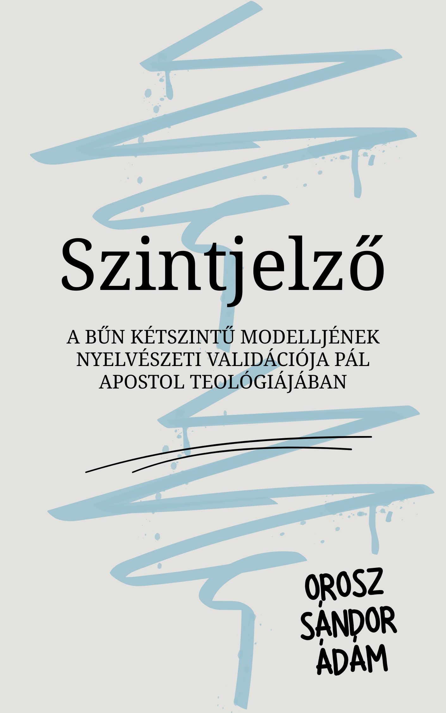

[← Vissza a főoldalra](/)

# Szintjelző

**Szerző:** Orosz Sándor Ádám  
**Publikáció dátuma:** 2026. március 14.  
**Licenc:** CC BY-NC-SA 4.0  
**DOI:** [https://doi.org/10.5281/zenodo.19025429](https://doi.org/10.5281/zenodo.19025429)

---

## 📄 Letöltés

- **PDF (Zenodo):** [Letöltés vagy olvasás pdf-ben](https://doi.org/10.5281/zenodo.19025429)

## 📙 [Ugrás a kényelmes, online olvasóhoz](/olvaso/szintjelzo.html)

- A szövegre kattintva jelenik meg a menürendszer

---

## Összefoglaló

Csak a Kol 2,13–14 sajátossága a páli bűn-nyelv kettőssége, vagy egy mélyebb mintázat nyoma? A tanulmány a szerző korábbi exegetikai munkájának nyelvészeti validációját végzi el, és azt vizsgálja, hogy Pál következetesen eltérő nyelvet használ-e a jogrendi vádirat és a tételes vétkek kezelésére. A páli korpusz lemma-alapú kollokációs elemzése alapján kirajzolódik egy funkcionális megkülönböztetés az ontológiai-jogrendi és a forenzikus-tételes bűn-nyelv között. Az eredmények nemcsak a Kol 2,13–14 értelmezéséhez adnak új támpontot, hanem a páli teológia és lelkigondozói alkalmazás összefüggéseihez is.

  

## 🧭 Tartalomjegyzék

---

- [Absztrakt](#absztrakt)
- [1. Bevezetés](#1-bevezetés)
- [2. Adatelemzés I.: az ontológiai/jogrendi szint (Level 1)](#2-adatelemzés-i-az-ontológiaijogrendi-szint-level-1)
- [3. Adatelemzés II.: a funkcionális/tételes szint (Level 2)](#3-adatelemzés-ii-a-funkcionálistételes-szint-level-2)
- [4. Konklúzió és gyakorlati alkalmazás](#4-konklúzió-és-gyakorlati-alkalmazás)
- [Melléklet A: Római levél adatbázis](#melléklet-a-római-levél-adatbázis)
- [Melléklet B: Galata és korinthusi levelek adatbázis](#melléklet-b-galata-és-korinthusi-levelek-adatbázis)
- [Melléklet C: Efézus és Kolossé levelek adatbázis](#melléklet-c-efézus-és-kolossé-levelek-adatbázis)
- [Melléklet D: Kisebb levelek és pásztori kontroll](#melléklet-d-kisebb-levelek-és-pásztori-kontroll)
- [Melléklet E: Kódolási protokoll és határesetek](#melléklet-e-kódolási-protokoll-és-határesetek)

---


{{ tartalom | markdownify }}
