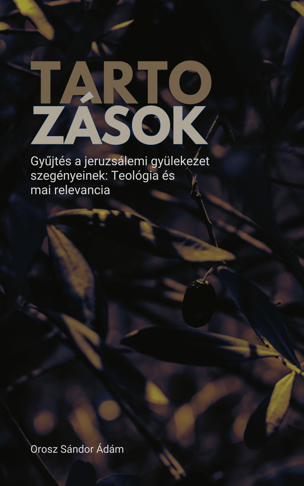

[← Vissza a főoldalra](/)

# Tartozások  
## Gyűjtés a jeruzsálemi gyülekezet szegényeinek: Teológia és mai relevancia

**Szerző:** Orosz Sándor Ádám  
**Publikáció dátuma:** 2025. június 16.  
**Licenc:** Creative Commons CC BY 4.0  
**DOI:** [https://doi.org/10.5281/zenodo.15676023](https://doi.org/10.5281/zenodo.15676023)
---

## 📄 Letöltés

- **PDF (Zenodo):** [Letöltés vagy olvasás pdf-ben](https://doi.org/10.5281/zenodo.15676023)

## 📙 [Ugrás a kényelmes, online olvasóhoz](/olvaso/tartozasok_olvaso.html)
 
 - A szövegre kattintva jelenik meg a menürendszer

---

## Összefoglaló

A tanulmány azt vizsgálja, mit ért Pál „tartozás” alatt a Róm 15,26–27-ben, amikor a pogány hátterű gyülekezeteket arra buzdítja, hogy anyagilag támogassák a jeruzsálemi szegény hívőket. A kiindulópont egyetlen görög szó: ὀφείλουσιν („tartoznak”). Pál ezzel az igével jogi–pénzügyi súlyú kifejezést használ, amely egyszerre utal behajtható adósságra és erkölcsi kötelezettségre. A tanulmány azt mutatja be, hogyan válik ez a kettős jelentés konkrét kötelezettséggé – a pogány hívők részéről, akik szellemi javakat kaptak, és időtlen elvvé – a közösségi egyenlőség (isotēs) érdekében, amelyet Pál a 2Kor 8,13–14-ben nevez meg. Végül a szöveg egy konkrét etikai algoritmust kínál arra, hogyan alkalmazható ez az elv ma is.

  

## 🧭 Tartalomjegyzék

---

- [Bevezetés](#bevezetés)
- [1. A „tartozás” kettős természete](#1-a-tartozás-kettős-természete)
- [2. A tartozás szereplői és feltételei](#2-a-tartozás-szereplői-és-feltételei)
- [3. A tartozás teológiai alapja](#3-a-tartozás-teológiai-alapja)
- [4. A kapcsolat szerepe a tartozásban](#4-a-kapcsolat-szerepe-a-tartozásban)
- [5. Időben korlátozott esemény vagy időtlen elv?](#5-időben-korlátozott-esemény-vagy-időtlen-elv)
- [6. A tartozás üdvtörténeti gyökerei](#6-a-tartozás-üdvtörténeti-gyökerei)
- [7. A tartozás elvének alkalmazása napjainkban](#7-a-tartozás-elvének-alkalmazása-napjainkban)
- [Záró összegzés](#záró-összegzés)
- [Irodalomjegyzék](#irodalomjegyzék)

---


{{ tartalom | markdownify }}
